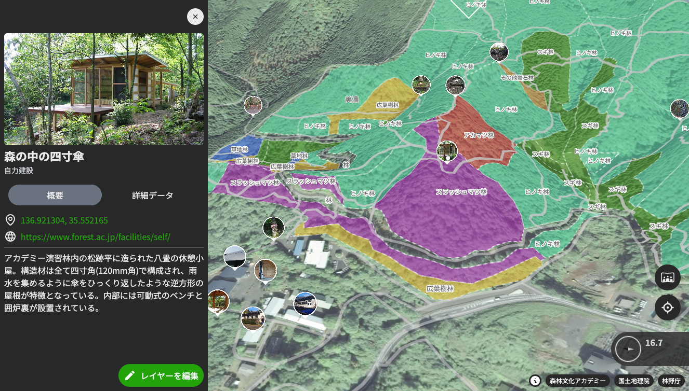

# morivis

morivis is an open-source web platform for exploring and visualizing forest data, specifically focusing on the training forest at the [Gifu Academy of Forest Science and Culture](https://www.forest.ac.jp/).

## Disclaimer

This project is an independent, personal initiative and is not an official project of the Gifu Academy of Forest Science and Culture.
Some data used in this project has been kindly provided by the academy, but the project itself is developed and maintained independently.

## ⚠️ Development Status

This project is currently in the alpha stage.

APIs, data structures, and features are subject to change without notice.

## Related Repository

The forest and geographic data used in this project are managed separately.
Please refer to the following repository for data management:

- [morivis-data (Data Management Repository)](https://github.com/forestacdev/morivis-data)
- [fac-cubemap-image (Cubemap Image Data)](https://github.com/forestacdev/fac-cubemap-image)

Note: This repository (morivis) focuses only on the application (frontend logic).
