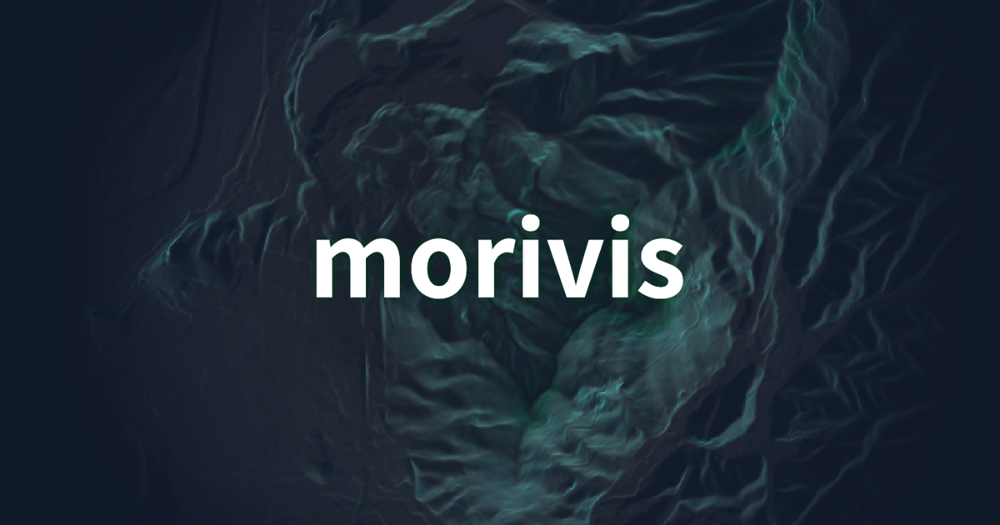

  
  

# morivis

**🌲 [Live Site →](https://forestacdev.github.io/morivis/)**

morivis is an open development web platform for exploring and visualizing forest data, specifically focusing on the training forest at the [Gifu Academy of Forest Science and Culture](https://www.forest.ac.jp/).

## Disclaimer

This project is an independent, personal initiative and is not an official project of the Gifu Academy of Forest Science and Culture.
Some data used in this project has been kindly provided by the academy, but the project itself is developed and maintained independently.

## ⚠️ Development Status

This project is currently in the alpha stage.

APIs, data structures, and features are subject to change without notice.

## Asset Delivery

Forest and geographic datasets are managed in the `data/` workspace of this monorepo.

Processed static assets under `data/assets/` are delivered by the AWS CDK stack in [`aws/`](aws/README.md), which uploads them to S3 and serves them through CloudFront.

Use `data/` for dataset preparation and asset generation, and `aws/` for infrastructure and delivery configuration.

## License

This project uses dual licensing:

### Source Code

- License: [MIT License](LICENSE-MIT)
- Scope: Application code, frontend logic
- Usage: Commercial use, modification, and distribution allowed

### Academy-Provided Data

- License: [CC BY-NC-ND 4.0](LICENSE-CC-BY-NC-ND)
- Scope: Data and resources provided by Gifu Academy of Forest Science and Culture
- Usage: Educational and research purposes only, no commercial use, no modifications
