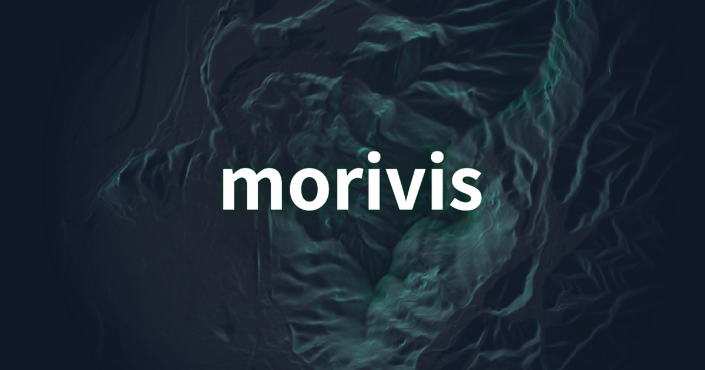
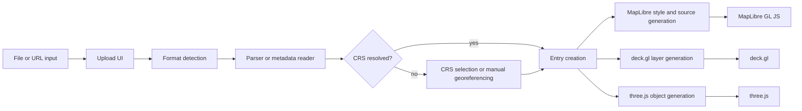

  

  
  
  
  
  
  
  
  

  
  

  

<h1 align="center">morivis</h1>

  A web platform for exploring forest data, surveying data, terrain rasters, and 3D geospatial content.

<h3 align="center">
  <a href="https://forestacdev.github.io/morivis/">Live Site</a>
</h3>

## Overview

morivis is an open development web platform for exploring and visualizing forest data, centered on the academy's training forest at the [Gifu Academy of Forest Science and Culture](https://www.forest.ac.jp/).

  

## Purpose

morivis is being developed as an open web platform for making forest data easier to explore and use.

It began from the idea that students, trainees, and future practitioners should have a more accessible way to work with forest-related geospatial data, centered on the academy's training forest but open to broader educational and practical use.

## Rendering Stack

- [`MapLibre GL JS`](https://maplibre.org/projects/gl-js/) for the main 2D map and style-driven layer rendering
- [`deck.gl`](https://deck.gl/) for 3D Tiles overlays and large data-driven visualization
- [`three.js`](https://threejs.org/) for mesh rendering and custom 3D map layers
- `WebGL workers` for Terrarium encoding, raster derivatives, reprojection, and heavy parsing

## Data Flow

```mermaid
graph LR
    A[File or URL input] --> B[Upload UI]
    B --> C[Format detection]
    C --> D[Parser or metadata reader]
    D --> E{CRS resolved?}
    E -- yes --> F[Entry creation]
    E -- no --> G[CRS selection or manual georeferencing]
    G --> F
    F --> H[MapLibre style and source generation]
    F --> I[deck.gl layer generation]
    F --> J[three.js object generation]
    H --> K[MapLibre GL JS]
    I --> L[deck.gl]
    J --> M[three.js]
```

The important architectural point is that style changes are driven declaratively. `Map.svelte` regenerates sources and layers, then hands the result to `mapStore.setStyle()` instead of mutating map layers ad hoc.

## Project Status

This project is in alpha.

- APIs may change without notice.
- Data structures and internal format pipelines are still evolving.
- Some parts of the project cover broad or experimental workflows, so regression risk remains until test coverage improves.

## Author

Developed by [Satoshi Komatsu](https://github.com/satoshi7190), an engineer and graduate of the Gifu Academy of Forest Science and Culture.

## Disclaimer

This project is an independent personal initiative and is not an official project of the Gifu Academy of Forest Science and Culture.

Some data used in this project has been provided by the academy, but the application itself is developed and maintained independently.

## Related Repository

- [morivis-data](https://github.com/forestacdev/morivis-data) - data hosting repository for deployment assets

## License

This project uses dual licensing.

### Source Code

- License: [MIT License](LICENSE-MIT)
- Scope: Source code in this repository
- Usage: Commercial use, modification, and distribution allowed
- Note: Third-party libraries are subject to their own licenses

### Academy-Provided Data

- License: [CC BY-NC-ND 4.0](LICENSE-CC-BY-NC-ND)
- Scope: Data and resources provided by Gifu Academy of Forest Science and Culture
- Usage: Educational and research purposes only, no commercial use, no modifications
