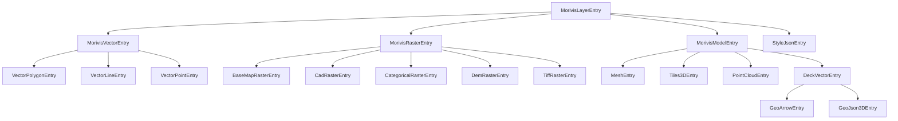

# Morivis Layer Entry Hierarchy

TypeDoc JSON から抽出した morivis のレイヤー型関係図です。

```mermaid
flowchart TD
    MorivisLayerEntry["MorivisLayerEntry"] --> MorivisRasterEntry["MorivisRasterEntry"]
    MorivisLayerEntry["MorivisLayerEntry"] --> MorivisVectorEntry["MorivisVectorEntry"]
    MorivisLayerEntry["MorivisLayerEntry"] --> MorivisModelEntry["MorivisModelEntry"]
    MorivisLayerEntry["MorivisLayerEntry"] --> StyleJsonEntry["StyleJsonEntry"]
    MorivisVectorEntry["MorivisVectorEntry"] --> VectorPolygonEntry["VectorPolygonEntry"]
    MorivisVectorEntry["MorivisVectorEntry"] --> VectorLineEntry["VectorLineEntry"]
    MorivisVectorEntry["MorivisVectorEntry"] --> VectorPointEntry["VectorPointEntry"]
    MorivisRasterEntry["MorivisRasterEntry"] --> BaseMapRasterEntry["BaseMapRasterEntry"]
    MorivisRasterEntry["MorivisRasterEntry"] --> CadRasterEntry["CadRasterEntry"]
    MorivisRasterEntry["MorivisRasterEntry"] --> CategoricalRasterEntry["CategoricalRasterEntry"]
    MorivisRasterEntry["MorivisRasterEntry"] --> DemRasterEntry["DemRasterEntry"]
    MorivisRasterEntry["MorivisRasterEntry"] --> TiffRasterEntry["TiffRasterEntry"]
    MorivisModelEntry["MorivisModelEntry"] --> MeshEntry["MeshEntry"]
    MorivisModelEntry["MorivisModelEntry"] --> Tiles3DEntry["Tiles3DEntry"]
    MorivisModelEntry["MorivisModelEntry"] --> PointCloudEntry["PointCloudEntry"]
    MorivisModelEntry["MorivisModelEntry"] --> DeckVectorEntry["DeckVectorEntry"]
    DeckVectorEntry["DeckVectorEntry"] --> GeoArrowEntry["GeoArrowEntry"]
    DeckVectorEntry["DeckVectorEntry"] --> GeoJson3DEntry["GeoJson3DEntry"]
```
