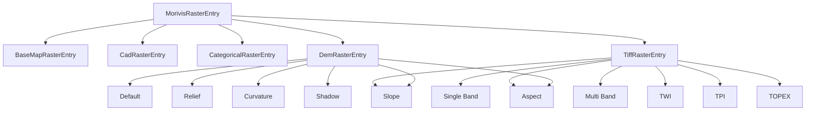

# Morivis Raster Entry Detail

TypeDoc JSON の型階層に、raster の主要分類と DEM / TIFF の可視化モードを補って整理した詳細図です。

```mermaid
flowchart TD
    MorivisRasterEntry["MorivisRasterEntry"] --> BaseMapRasterEntry["BaseMapRasterEntry"]
    MorivisRasterEntry["MorivisRasterEntry"] --> CadRasterEntry["CadRasterEntry"]
    MorivisRasterEntry["MorivisRasterEntry"] --> CategoricalRasterEntry["CategoricalRasterEntry"]
    MorivisRasterEntry["MorivisRasterEntry"] --> DemRasterEntry["DemRasterEntry"]
    MorivisRasterEntry["MorivisRasterEntry"] --> TiffRasterEntry["TiffRasterEntry"]
    DemRasterEntry["DemRasterEntry"] --> Default["Default"]
    DemRasterEntry["DemRasterEntry"] --> Relief["Relief"]
    DemRasterEntry["DemRasterEntry"] --> Slope["Slope"]
    DemRasterEntry["DemRasterEntry"] --> Aspect["Aspect"]
    DemRasterEntry["DemRasterEntry"] --> Curvature["Curvature"]
    DemRasterEntry["DemRasterEntry"] --> Shadow["Shadow"]
    TiffRasterEntry["TiffRasterEntry"] --> Single_Band["Single Band"]
    TiffRasterEntry["TiffRasterEntry"] --> Multi_Band["Multi Band"]
    TiffRasterEntry["TiffRasterEntry"] --> TWI["TWI"]
    TiffRasterEntry["TiffRasterEntry"] --> Slope["Slope"]
    TiffRasterEntry["TiffRasterEntry"] --> Aspect["Aspect"]
    TiffRasterEntry["TiffRasterEntry"] --> TPI["TPI"]
    TiffRasterEntry["TiffRasterEntry"] --> TOPEX["TOPEX"]
```
