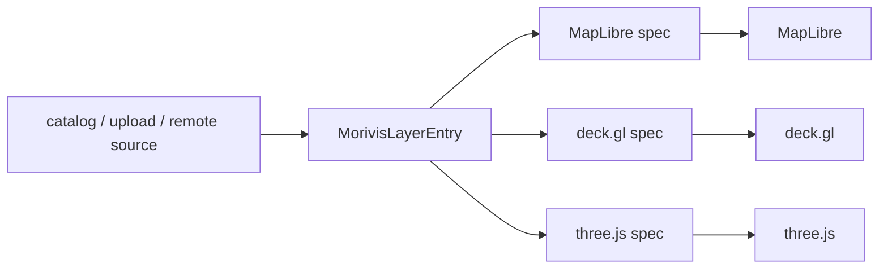

# MorivisLayerEntry モデル

morivis では、地図上の表示対象を `MorivisLayerEntry` という内部モデルで扱う。  
この文書は、`MorivisLayerEntry` の役割、分類軸、責務境界、描画系への変換段階を整理するためのたたき台である。

## 1. 何を解決するモデルか

morivis は、同じ WebGIS の中で次のような異種データを扱う。

- ベクター地物
- ラスタータイル
- GeoTIFF / DEM 可視化
- 3D Tiles
- メッシュモデル
- 点群

これらを地図ライブラリごとの生 API で直接扱うと、追加・表示切替・スタイル変更・プレビューのたびに分岐が増える。  
`MorivisLayerEntry` は、その差をアプリ内部で吸収するための共通単位である。

## 2. 基本方針

- レイヤーは、まず `MorivisLayerEntry` として表現する
- UI やストアは、地図ライブラリの直接 API ではなく `MorivisLayerEntry` を主語に扱う
- 描画時にだけ、`MorivisLayerEntry` から MapLibre / deck.gl / three.js 向けの表現へ変換する
- 新しい形式を追加するときは、まず `MorivisLayerEntry` に正規化できるかを考える

## 3. 型の位置づけ

`MorivisLayerEntry` は、外部カタログ形式でも、描画ライブラリの設定オブジェクトでもない。  
morivis の内部でレイヤーを統一的に扱うためのアプリケーションモデルである。

```ts
type MorivisLayerEntry =
	| MorivisVectorEntry
	| MorivisRasterEntry
	| MorivisModelEntry;
```

将来的に別系統の entry を増やす場合も、まず「レイヤーとして扱うべきか」をここで判断する。

## 4. 分類軸

`vector / raster / model` は同じ意味の粒度ではない。  
無理に同じ軸に揃えるのではなく、それぞれに自然な分類軸を採用する。

### Vector

- 主分類軸: geometry
- 子分類: `VectorPointEntry` `VectorLineEntry` `VectorPolygonEntry`
- format は取得方式として扱う

代表的な format:

- `geojson`
- `fgb`
- `mvt`
- `pmtiles`
- `mbtiles`
- `geojsontile`
- `esri-feature`
- `ogc-feature`
- `wfs-feature`

### Raster

- 主分類軸: visualization
- 子分類: `BaseMapRasterEntry` `CategoricalRasterEntry` `DemRasterEntry` `TiffRasterEntry` `CadRasterEntry`
- format は配信・格納方式として扱う

代表的な format:

- `image`
- `pmtiles`
- `mbtiles`
- `cog`
- `wcs`
- `geozarr`

`DemRasterEntry` は `relief / slope / aspect / curvature / shadow` のような可視化モードを持ち、  
`TiffRasterEntry` は `single / multi / twi / slope / aspect / tpi / topex` のようなバンド可視化モードを持つ。

### Model

- 主分類軸: object / runtime
- 子分類: `MeshEntry` `Tiles3DEntry` `PointCloudEntry` `DeckVectorEntry`
- runtime の違いをモデル側で明示する

補足:

- `MeshEntry` は主に three.js
- `Tiles3DEntry` `PointCloudEntry` `DeckVectorEntry` は主に deck.gl

## 5. entry に持たせる責務

`MorivisLayerEntry` には、レイヤーの定義として安定しているものを持たせる。

- `id`
- `type`
- `format`
- `metaData`
- `interaction`
- `style`
- 必要最小限の `properties`
- 必要最小限の `state`

ここでいう `style` は、描画方法の宣言的な定義である。  
MapLibre の生レイヤー JSON や three.js の `Object3D` そのものは持たせない。

## 6. entry に持たせないもの

`MorivisLayerEntry` に何でも載せると、内部モデルが便利箱になる。  
次のようなものは極力外に出す。

- MapLibre インスタンス依存の一時状態
- deck.gl / three.js の実体オブジェクト
- 描画ライブラリ固有のキャッシュ実装
- UI コンポーネント都合だけの表示状態
- 非永続的な一時操作結果

これらは runtime 層または UI 層で扱う。

## 7. state と runtime の境界

### entry.state

`entry.state` は、アプリとして保存・同期したい状態に限る。

例:

- 現在の time dimension index
- temporal filter の有効状態
- animation clip の選択状態

### runtime state

描画エンジン内部の一時状態は runtime 側に置く。

例:

- MapLibre source/layer の実体
- three.js の `Object3D`
- deck.gl layer instance
- 各種キャッシュキーや in-flight promise

## 8. 変換段階

morivis のレイヤー処理は、少なくとも次の段階に分けて考える。

1. カタログまたは入力データ
2. `MorivisLayerEntry` への正規化
3. 描画系ごとの spec 生成
4. ランタイムへの反映



重要なのは、`MorivisLayerEntry` を描画系の直前に置くことではなく、  
アプリ全体で扱う共通モデルとして置くことである。

## 9. 設計上の利点

### 技術面

- 異なる形式を共通モデルに正規化できる
- MapLibre 依存を直接広げずに済む
- `vector / raster / model` を同じレイヤー管理系に載せられる
- three.js や deck.gl に自然に分岐できる

### 実装面

- 表示切替、並び替え、プレビューを共通フローで扱える
- style と interaction の責務を entry に集約できる
- `entry -> render spec` の変換点を明示できる
- テスト対象をライブラリ副作用より変換ロジックに寄せられる

### 運用面

- 新しい形式を追加するときの接続点が明確
- 命名と責務の共通認識を持ちやすい
- レイヤー数が増えても設計が崩れにくい
- 図やドキュメントに落とし込みやすい

## 10. 現状の改善課題

現状の morivis では、次の点を継続的に整理する必要がある。

- 分類軸が場所によって混ざらないようにする
- `entry` に載せる責務を増やしすぎない
- `Map.svelte` と `map.ts` への責務集中を緩和する
- カタログ層と内部モデル層をより明確に分離する

## 11. 当面のルール

- 新しいレイヤー形式を追加するときは、まず `MorivisLayerEntry` のどこに収まるかを決める
- geometry / visualization / runtime の軸を混ぜない
- 描画ライブラリ固有の都合は、できるだけ spec 生成以降の層で吸収する
- `entry` は内部レイヤー定義であり、描画実体そのものではない
