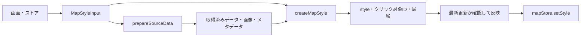

# スタイル生成と3Dモデルの実行時処理

## MapLibreスタイル

`Map.svelte` が画面の状態を読み、非同期処理を始める前に `MapStyleInput` としてスナップショットを取る。スタイル生成関数はストアを参照せず、入力からMapLibreの仕様とクリック対象ID・帰属情報を返す。

| ファイル | 責務 |
| --- | --- |
| `frontend/src/routes/map/components/Map.svelte` | 入力の取得、準備処理の呼び出し、最新更新の判定、ストアと地図への反映 |
| `frontend/src/routes/map/utils/sources/prepare.ts` | 通信、GeoJSON・TIFFキャッシュ、画像生成、COGメタデータの準備 |
| `frontend/src/routes/map/utils/sources/index.ts` | 明示的な設定と準備済みデータからsource仕様を生成 |
| `frontend/src/routes/map/utils/layers/index.ts` | 明示的な設定からlayer仕様・クリック対象ID・帰属情報を生成 |
| `frontend/src/routes/map/utils/style/map-style.ts` | main・preview・補助レイヤーを合成してスタイルを返す |

背景地図、地形、ラベル、プレビューなどの切替は入力に含める。時間次元切替に伴う表示レンジの変更は準備結果として返し、最新結果の適用時に `sources/raster-updates.ts` からUIへ同期する。準備中のユーザー編集は上書きしない。メインとプレビューの帰属は合算する。古い非同期処理の結果はスタイル・クリック対象・帰属へ反映せず、準備側も採用されない結果で画像・GeoJSONキャッシュを上書きしない。

プロトコルの登録・解放、3Dモデルの同期、NetCDF内部のWorker処理は実行時処理として残る。`createMapStyle` 自体からは呼び出さない。準備処理を失効させても、開始済みWorkerの計算そのものを中断するわけではない。

## Three.jsモデル

`ThreeJsLayerManager` は画面側の公開APIを保ちながら、モデル登録、差し替え、アニメーション更新と各サービスの呼び出し順を管理する。モデルの読み込み完了をそのまま登録せず、削除・置き換えで失効した結果は破棄する。

| ファイル（`frontend/src/routes/map/utils/three/`） | 責務 |
| --- | --- |
| `layer-manager.ts` | 登録済みモデル、LOD切替、アニメーション、属性の事前取得、GLB出力、各サービスの接続 |
| `model-loader.ts` | 形式別の読み込み、座標原点・軸・単位の正規化。object・animation・属性取得関数を返す |
| `model-materials.ts` | シェーダー・材質・エッジの生成と更新、モデル描画資源の解放 |
| `model-renderer.ts` | 共有WebGLコンテキストとscene/camera、通常描画、地形透過の合成、単体ビュー描画 |
| `model-placement-controller.ts` | 配置プレビュー、拡縮ハンドル、ポインター操作、DOMとイベントの後片付け |
| `model-interaction-controller.ts` | 選択・属性ピック・ハイライト、単体ビューの開始と復元 |
| `model-runtime-types.ts` | 読み込み済み実体とアニメーション状態の型 |
| `ifc-runtime-attributes.ts` | IFCの交差結果から部材ID・属性を取得 |

読み込み側はシーンへ登録せず、描画側は通信やストア参照を行わない。描画フレームには登録済みモデル、投影行列、表示領域の高さ、必要なら単体ビューのカメラを渡す。配置操作は変更後のtransformをコールバックで通知する。

カスタムレイヤーが外れたときは操作をdetachしてモデルを消去する。画面を離れるときの `dispose()` では操作状態、GPU資源、デコーダーも解放する。配置中のポインターcaptureと地図パン、単体ビュー用の軸補正と床も復元・解放する。

## 検証

- `utils/style/map-style.spec.ts`：ストアなしでの生成、背景地図・プレビュー、クリック対象と帰属、source解決。
- `utils/sources/prepare.spec.ts`：準備処理と古い非同期結果のキャッシュ反映抑止。
- `utils/three/model-*.spec.ts`、`layer-manager.spec.ts`：各境界の動作、描画順、状態復元、読み込み競合と資源解放。
- `frontend/e2e/model-morph.test.ts`：実際のモデル用GLSLでモーフ・スキニング・リセットをGPU検証。

テストの成功は、全ファイル形式の読み込みやすべての実機GPUを網羅したことを意味しない。
