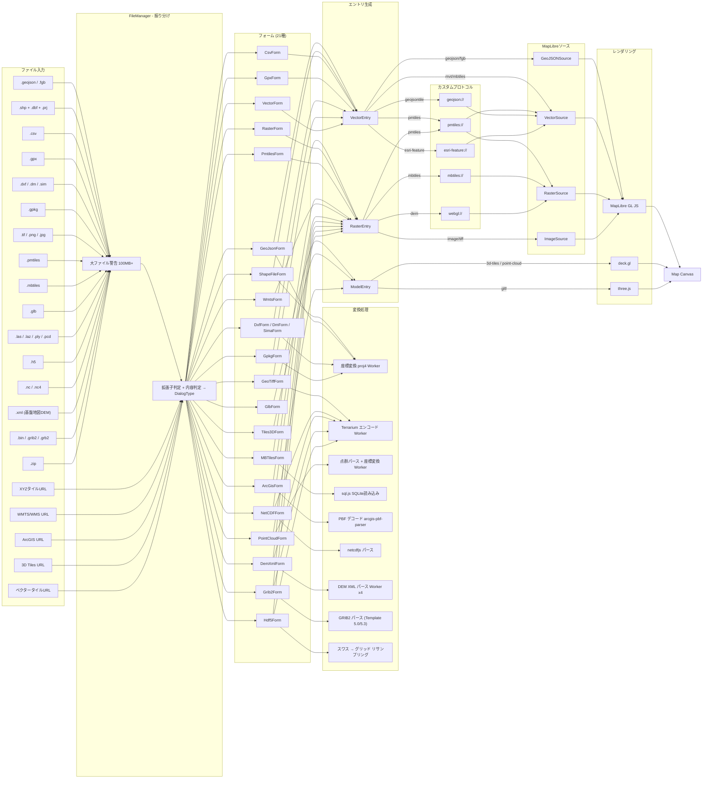

# データパイプライン

morivisのデータ入力からレンダリングまでの全体フローを記載する。

## アーキテクチャ概要



## 対応データ形式一覧

### ベクター（ファイル）

| 形式 | 拡張子 | フォーム | 変換 | format type | ソース | レンダラー |
|---|---|---|---|---|---|---|
| GeoJSON | .geojson | GeoJsonForm | proj4 | geojson | GeoJSONSource | MapLibre |
| FlatGeobuf | .fgb | GeoJsonForm | proj4 | fgb | GeoJSONSource | MapLibre |
| Shapefile | .shp+.dbf+.prj+.shx | ShapeFileForm | proj4 Worker並列 | geojson | GeoJSONSource | MapLibre |
| GeoPackage | .gpkg | GpkgForm | proj4 | geojson | GeoJSONSource | MapLibre |
| GPX | .gpx | GpxForm | - | geojson | GeoJSONSource | MapLibre |
| CSV | .csv | CsvForm | 緯度経度→Point | geojson | GeoJSONSource | MapLibre |
| DXF | .dxf | DxfForm | proj4 | geojson | GeoJSONSource | MapLibre |
| DM | .dm | DmForm | - | geojson | GeoJSONSource | MapLibre |
| SIMA | .sim | SimaForm | - | geojson | GeoJSONSource | MapLibre |
| HDF5 (衛星ベクター) | .h5 | Hdf5Form | - | geojson | GeoJSONSource | MapLibre |

### ベクター（タイルサービス）

| 形式 | 入力 | フォーム | プロトコル | format type | ソース | レンダラー |
|---|---|---|---|---|---|---|
| PBF (MVT) | URL | VectorForm | - | mvt | VectorSource/tiles | MapLibre |
| GeoJSONタイル | URL | VectorForm | geojson:// | geojsontile | VectorSource/tiles | MapLibre |
| PMTiles (vector) | URL/ファイル | PmtilesForm | pmtiles:// | pmtiles | VectorSource/url | MapLibre |
| MBTiles (vector) | ファイル | MBTilesForm | mbtiles:// | mbtiles | VectorSource/tiles | MapLibre |
| ArcGIS FeatureServer | URL | ArcGisForm | esri-feature:// | esri-feature | VectorSource/tiles | MapLibre |

### ラスター（ファイル）

| 形式 | 拡張子 | フォーム | 変換 | format type | ソース | レンダラー |
|---|---|---|---|---|---|---|
| GeoTIFF | .tif/.tiff | GeoTiffForm | Terrarium Worker | tiff | ImageSource | MapLibre |
| PNG/JPEG + aux.xml | .png/.jpg + .aux.xml | GeoTiffForm | Terrarium Worker | tiff | ImageSource | MapLibre |
| PNG/JPEG + ワールドファイル | .png/.jpg + .pgw/.jgw | GeoTiffForm | Terrarium Worker | tiff | ImageSource | MapLibre |
| NetCDF | .nc/.nc4 | NetCDFForm | netcdfjs + Terrarium Worker | tiff | ImageSource | MapLibre |
| 基盤地図情報 DEM XML | .xml/.zip | DemXmlForm | XML Worker x4 + Terrarium Worker | tiff | ImageSource | MapLibre |
| GRIB2 (GPV) | .bin/.grib2/.grb2 | Grib2Form | GRIB2パーサー + Terrarium Worker | tiff | ImageSource | MapLibre |
| HDF5 (ラスター) | .h5 | Hdf5Form | jsfive + スワスリサンプリング + Terrarium Worker | tiff | ImageSource | MapLibre |

### ラスター（タイルサービス）

| 形式 | 入力 | フォーム | プロトコル | format type | ソース | レンダラー |
|---|---|---|---|---|---|---|
| XYZ画像タイル | URL | RasterForm | - | image | RasterSource/tiles | MapLibre |
| XYZ DEMタイル | URL | RasterForm | webgl:// | image (dem) | RasterSource/tiles | MapLibre |
| WMS/WMTS | URL | WmtsForm | - | image | RasterSource/tiles | MapLibre |
| PMTiles (raster) | URL/ファイル | PmtilesForm | pmtiles:// | pmtiles | RasterSource/url | MapLibre |
| MBTiles (raster) | ファイル | MBTilesForm | mbtiles:// | mbtiles | RasterSource/tiles | MapLibre |
| ArcGIS MapServer | URL | ArcGisForm | - | image | RasterSource/tiles | MapLibre |

### 3Dモデル・点群

| 形式 | 拡張子/入力 | フォーム | 変換 | format type | レンダラー |
|---|---|---|---|---|---|
| GLB/glTF | .glb | GlbForm | - | gltf | three.js |
| 3D Tiles | URL (tileset.json) | Tiles3DForm | - | 3d-tiles | deck.gl (Tile3DLayer) |
| LAS/LAZ | .las/.laz | PointCloudForm | proj4 Worker | point-cloud | deck.gl (PointCloudLayer) |
| PLY | .ply | PointCloudForm | proj4 Worker | point-cloud | deck.gl (PointCloudLayer) |
| PCD | .pcd | PointCloudForm | proj4 Worker | point-cloud | deck.gl (PointCloudLayer) |

## カスタムプロトコル

MapLibreの`addProtocol`を使って、独自のタイル配信プロトコルを実装している。

| プロトコル | 用途 | Worker | 遅延初期化 |
|---|---|---|---|
| `geojson://` | GeoJSONタイル化 | protocol_geojson.worker | 常時起動 |
| `pmtiles://` | PMTilesアーカイブ読み込み | - (pmtilesライブラリ) | 常時起動 |
| `mbtiles://` | MBTilesファイル読み込み (sql.js) | - (Wasm) | 常時起動 |
| `esri-feature://` | ArcGIS FeatureServer bbox PBFクエリ | protocol_esri_feature.worker | 動的登録/解除 |
| `webgl://` | DEM標高シェーダー処理 | protocol_dem.worker | 常時起動 |

## エントリ型システム

```
GeoDataEntry (Union)
├── VectorEntry<MetaData>
│   ├── format.type: geojson | fgb | mvt | pmtiles | mbtiles | geojsontile | esri-feature
│   ├── format.geometryType: Point | LineString | Polygon | Label
│   └── style: PointStyle | LineStyle | PolygonStyle
│       ├── colors: ColorsStyle (single | match | step | linear)
│       ├── numbers: NumbersStyle
│       ├── labels: LabelsStyle
│       └── extrusion / heatmap / pattern
│
├── RasterEntry<Style>
│   ├── format.type: image | pmtiles | mbtiles | cog | tiff
│   └── style: RasterBaseMapStyle | RasterDemStyle | RasterTiffStyle | RasterCadStyle
│       ├── opacity, visible, minZoom, maxZoom
│       └── visualization (DEM: relief/slope/aspect/curvature, Tiff: single/multi band)
│
└── ModelEntry
    ├── ModelMeshEntry<MeshStyle>     → three.js (GLB)
    ├── ModelTiles3DEntry<Style>      → deck.gl (3D Tiles)
    └── ModelPointCloudEntry          → deck.gl (LAS/LAZ/PLY/PCD)
```

## スタイル更新フロー

```
リアクティブな値の変更
    ↓
Map.svelte: createMapStyle() でスタイル定義(sources, layers)を再生成
    ↓
setStyleDebounce → mapStore.setStyle()
    ↓
MapLibre GL JS がスタイルを適用・差分更新
```

- `mapStore.setStyle()`を通じてスタイルを変更するのが基本
- `mapStore.setData()`や`mapStore.setFilter()`による命令的な直接操作は避ける
- deck.glレイヤーは`mapStore.setDeckOverlay()`で別途管理
- three.jsレイヤーは`mapStore.setThreeLayer()`で別途管理

## Worker一覧

| Worker | パス | 用途 | ライフサイクル |
|---|---|---|---|
| terrarium_encode | geotiff/terrarium_encode.worker.ts | バンドデータ→Terrarium PNGエンコード | 遅延初期化、エンコード完了後terminate |
| terrarium_render | geotiff/terrarium_render.worker.ts | Terrarium PNG→最終画像レンダリング(WebGL) | 遅延初期化、全TIFFエントリ解放後terminate |
| transformer | proj/transformer.worker.ts | GeoJSON座標変換(並列) | 変換時に起動、完了後terminate |
| pointcloud_transformer | proj/pointcloud_transformer.worker.ts | 点群座標変換 | 変換時に起動、完了後terminate |
| xml-parser | file/dem-xml/xml-parser.worker.ts | 基盤地図DEM XMLパース(4並列) | 解析時に起動、完了後terminate |
| protocol_geojson | protocol/vector/geojson/protocol_geojson.worker.ts | GeoJSON→ベクタータイル化 | 常時起動 |
| protocol_esri_feature | protocol/vector/esri-feature/protocol_esri_feature.worker.ts | ArcGIS PBF→ベクタータイル化 | 遅延初期化、レイヤー解除後terminate |
| protocol_dem | protocol/raster/protocol_dem.worker.ts | DEM標高→シェーダー画像 | オンデマンド |
| generation_icon | utils/icon/generation_icon.worker.ts | アイコン画像生成 | 常時起動 |

## レンダラー

| レンダラー | 用途 | 統合方法 |
|---|---|---|
| **MapLibre GL JS** | ラスター・ベクター地図の描画 | メインの地図エンジン |
| **deck.gl** | 3D Tiles・点群の描画 | `MapboxOverlay`としてMapLibreに追加 |
| **three.js** | GLBメッシュモデルの描画 | カスタムレイヤーとしてMapLibreに追加 |
