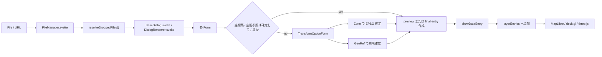
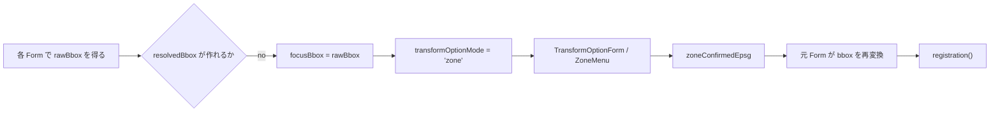
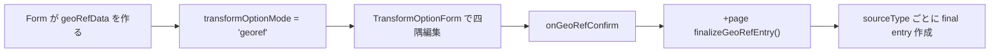
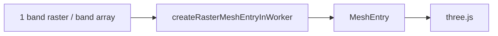
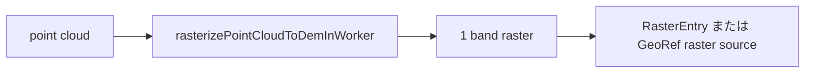
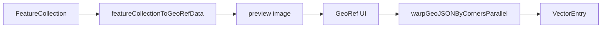

# データパイプライン

morivis では、ファイルや URL から受け取ったデータを解析し、必要なら座標系を確定し、`MorivisLayerEntry` に正規化してから描画系へ渡す。  
この文書は、実装上の責務分担と状態遷移を追えるように、アップロード導線を中心に整理したもの。

`MorivisLayerEntry` 自体の役割と責務境界は [内部レイヤーモデル](./architecture/entry-model.md) を参照。

## 全体像

```mermaid
flowchart LR
	A["File / URL"] --> B["FileManager.svelte"]
	B --> C["resolveDroppedFiles()"]
	C --> D["BaseDialog.svelte / DialogRenderer.svelte"]
	D --> E["各 Form"]
	E --> F{"座標系 / 空間参照は確定しているか"}
	F -- yes --> G["preview または final entry 作成"]
	F -- no --> H["TransformOptionForm"]
	H --> I["Zone で EPSG 確定"]
	H --> J["GeoRef で四隅確定"]
	I --> G
	J --> G
	G --> K["showDataEntry"]
	K --> L["layerEntries へ追加"]
	L --> M["MapLibre / deck.gl / three.js"]
```

## 入口

アップロード系の入口は次の 4 層で分かれる。

| 層 | 主な責務 |
| --- | --- |
| `FileManager.svelte` | 入力ファイル群や URL を受け取り、`resolveDroppedFiles()` に渡す。大容量ファイル確認や remote KML model の即時登録もここで扱う。 |
| `upload-drop.ts` / `upload-drop-matchers.ts` | 拡張子、複数ファイル組み合わせ、ZIP 展開後の中身、XML 先頭内容を見て `DialogType` を決める。 |
| `BaseDialog.svelte` / `DialogRenderer.svelte` | `showDialogType` と `dialog-registry.ts` をもとに対象 Form を選び、profile に応じて必要な bind 状態を渡す。 |
| `components/upload/form/*.svelte` | 形式ごとの解析、座標系判定、preview 準備、最終 entry 作成を担当する。 |

## 定義元

対応形式が増えたので、どこを真実の定義として見るかを明示しておく。

| ファイル | 役割 |
| --- | --- |
| `types/index.ts` | `DialogType` と `SUPPORTED_FILE_GROUPS`。UI に見せる対応拡張子の定義元。 |
| `upload-drop.ts` | ファイルや URL をどの `DialogType` に振り分けるかの定義元。 |
| `dialog-registry.ts` | `DialogType -> Form / profile` の対応表。 |
| `transform-policy.ts` | 形式ごとの `zone` / `georef` 許可方針。 |
| `components/upload/form/*.svelte` | 各形式の preview / final entry 作成の実装本体。 |

## 中間状態

アップロード導線で頻出する状態は次の通り。

| 状態 | 置き場所 | 役割 |
| --- | --- | --- |
| `showDialogType` | `+page.svelte` | 今どの Form を開いているか。 |
| `dropFile` | `+page.svelte` | 現在処理中のファイルまたはファイル群。 |
| `showDataEntry` | `+page.svelte` | preview 中または直近に確定した `MorivisLayerEntry`。 |
| `focusBbox` | `+page.svelte` | Zone UI で候補 EPSG を可視化する元 bbox。 |
| `selectedEpsgCode` | `+page.svelte` | Zone UI で現在選択中の EPSG。 |
| `zoneConfirmedEpsg` | `+page.svelte` | Zone UI で確定した EPSG。各 Form 側がこれを受けて再変換する。 |
| `transformOptionMode` | `+page.svelte` | `zone` / `georef` / `null`。補助 UI の現在モード。 |
| `pendingZoneGeoRefData` | `+page.svelte` | ベクターを Zone のあと GeoRef に回すときの一時データ。 |
| `geoRefData` | `+page.svelte` | GeoRef UI に渡す共通データ。ラスター、ベクター、点群をここに乗せる。 |
| `geoRefPreviewData` | `+page.svelte` | GeoRef 中のプレビュー四隅と画像 URL。 |
| `rawBbox` | 各 Form | 元データが持っていた bbox。まだ WGS84 に確定していない場合がある。 |
| `resolvedBbox` | 各 Form | そのまま entry に使える bbox。 |

## 分岐

アップロード後の分岐は、大きく 4 つある。

| 分岐 | 条件 | 次の責務 |
| --- | --- | --- |
| そのまま登録 | `resolvedBbox` がある、または座標系確定済み | Form 内で final entry を作る。 |
| Zone へ進む | `rawBbox` はあるが `resolvedBbox` がまだない | `TransformOptionForm` で EPSG を確定し、元 Form に戻して再変換する。 |
| GeoRef へ進む | bbox が無い、または四隅で位置合わせしたい | `geoRefData` を作り、`TransformOptionForm` を `georef` で開く。 |
| preview のみ作る | ベクター GeoRef、点群 GeoRef、画像 GeoRef の準備段階 | `showDataEntry` ではなく `geoRefPreviewData` を更新する。 |

## 形式別フロー

現在の `DialogType` に近い粒度で、主要な流れをまとめる。

| 系統 | 主な形式 | 解析 | 座標系 / 配置の確定 | preview | final entry | worker / 補助実装 |
| --- | --- | --- | --- | --- | --- | --- |
| ベクター JSON / XML / テキスト | GeoJSON, TopoJSON, WKT, GML, KML, GeoRSS, OSM, MIF/MID, MF-JSON | 各 Form で `FeatureCollection` 化 | bbox が不正なら Zone。必要なら GeoRef へ進む | GeoRef 用は `featureCollectionToGeoRefData()` | 各 Form または `+page.svelte finalizeGeoRefEntry()` | 座標変換、GeoRef ベクター変形 |
| 表形式ベクター | CSV, TSV, XLSX, Garmin GDB, Location History, GTFS | テーブルやログを `FeatureCollection` 化 | bbox が不正なら Zone。形式によってはそのまま登録 | 必要なら vector→GeoRef 用ラスター化 | 各 Form または `+page.svelte finalizeGeoRefEntry()` | 座標変換、GeoRef ベクター変形 |
| 複合ベクターファイル | Shapefile, GeoPackage, SQLite / SQL dump, GeoParquet, GeoArrow | パーサーで `FeatureCollection` または Arrow Table 化 | `.prj` や埋め込み定義で自動、足りなければ Zone。GeoArrow は現状 Zone のみ | 必要なら vector→GeoRef 用ラスター化 | 各 Form または `+page.svelte finalizeGeoRefEntry()` | GPKG / SQLite / GeoParquet / GML などは worker 解析あり |
| CAD / 測量 / 地籍ベクター | DXF, DWG, DM, SIMA, MojXML | 独自パーサーで `FeatureCollection` 化 | 多くは Zone 起点。必要なら GeoRef へ流せる | 必要なら vector→GeoRef 用ラスター化 | 各 Form または `+page.svelte finalizeGeoRefEntry()` | DXF / DWG / DM 解析 worker、座標変換 |
| 画像ラスタ / 画像由来 | GeoTIFF, GeoPDF, SVG, GeoPhoto, 画像 + `tfw`, 画像 + `aux.xml` | 埋め込み情報、sidecar、EXIF、PDF / SVG の内容から解析 | bbox と CRS が揃えば直行。無ければ Zone または GeoRef | `createRasterGeoRefData()`、GeoPhoto は地物 entry | 各 Form または `+page.svelte finalizeGeoRefEntry()` | GeoTIFF / GeoPDF 解析、bbox 変換、必要ならメッシュ化 |
| 科学技術・衛星ラスタ | DEM XML, NetCDF, GRIB2, HDF5, HRIT/LRIT | バンド配列や観測画像へ展開 | 形式ごとに自動、または GeoRef / Zone | `createRasterGeoRefData()` | 各 Form または `+page.svelte finalizeGeoRefEntry()` | 解析 worker、Terrarium 変換、3Dメッシュ化 |
| 点群 | LAS, LAZ, COPC, PLY, PCD, XYZ, OBJ 点群 | positions / colors / pointCount を生成 | bbox が不正なら Zone。登録方法で raster / pointcloud に分岐 | 点群 GeoRef は pointcloud 用 `geoRefData`。DEM 化は raster 用 `geoRefData` | `PointCloudForm.svelte` または `+page.svelte finalizeGeoRefEntry()` | 点群解析、DEM ラスタライズ、GeoRef 点群変形 |
| TIN / サーフェス | LandXML | TIN, breakline, point 群を解析。必要に応じて DEM 化 | Zone または GeoRef | ラスター preview または mesh 準備 | `LandXmlForm.svelte` または `+page.svelte finalizeGeoRefEntry()` | rasterize worker、3Dメッシュ化 |
| 3D モデル | GLB, OBJ, 3DS, DAE, 3DM, FBX, DRC, 3MF, AMF, IFC | three.js 系が扱える URL / Blob に正規化 | 主に Zone または手動配置 | なし | モデル entry を直接作る | bounds 計算、形式別 loader |
| 3D Tiles / タイルデータ | 3D Tiles, PMTiles, MBTiles | URL / ファイルから source metadata を構築 | 通常は CRS 解決不要。PMTiles / MBTiles は source 種別の分岐あり | なし | source / model entry を直接作る | PMTiles protocol, MBTiles reader |
| リモート配信 / カタログ | WMTS, WCS, GeoZarr, FeatureService, WFS, OGC API Features, STAC, ArcGIS WebMap / service, Raster URL, Vector URL | メタデータ問い合わせや capabilities 解析 | 形式ごとのポリシーに従う | WCS / STAC / vector は必要に応じて preview | 各 Form または `+page.svelte finalizeGeoRefEntry()` | capabilities fetch、STAC / WCS / ArcGIS 解析 |

## dialog profile

`dialog-registry.ts` は各 `DialogType` を、Form の性質ごとに profile へ寄せている。  
形式が増えた今は、この profile を見ると責務のまとまりが追いやすい。

| profile | 典型的な形式 | 役割 |
| --- | --- | --- |
| `simple` | STAC, ArcGIS | `dropFile` を持たず、URL や内部状態だけで完結する。 |
| `drop-file` | GPX, TCX, GDB, GTFS, HRIT, HDF5, MF-JSON, LocationHistory | 受け取ったファイルをそのまま解析して entry を作る。 |
| `vector-zone` | GeoArrow | Zone は使うが GeoRef には流さない。 |
| `vector-zone-georef` | GeoJSON, Shapefile, GeoParquet, DXF, GML, MojXML など | Zone と GeoRef の両方を取りうる。 |
| `vector-georef` | SVG | GeoRef のみを持つ。 |
| `raster-georef` | DEM XML, NetCDF, GeoPDF | 主に GeoRef で配置を確定する。 |
| `pointcloud-georef` | GeoTIFF, PointCloud, LandXML | Zone と GeoRef の両方を持ち、場合によって raster / mesh / pointcloud に分岐する。 |
| `model-georef` | GLB 系 | モデル配置や Zone を扱う。 |
| `remote-*` / `feature-service` / `wcs` | WMTS, GeoZarr, Raster URL, FeatureService など | URL や remote metadata を起点に source / entry を作る。 |

## TransformOptionForm の責務

`TransformOptionForm.svelte` は final entry を作らない。ここは補助 UI であり、責務は次の 2 つだけ。

1. `zone`
EPSG 候補を可視化し、`zoneConfirmedEpsg` または `onZoneGeoRef` へ返す。

2. `georef`
四隅を動かして `GeoRefConfirmPayload` を作り、`onGeoRefConfirm` へ返す。

重要なのは、GeoRef 確定後の final entry 作成が `TransformOptionForm` ではなく `+page.svelte` の `finalizeGeoRefEntry()` に集約されている点である。

## final entry を作る場所

この一覧を押さえておくと、フローの追跡がかなり楽になる。

| entry 種別 | どこで作るか |
| --- | --- |
| 通常ベクター entry | 各ベクター Form |
| 通常ラスター entry | 各ラスター Form |
| 通常点群 entry | `PointCloudForm.svelte` |
| 通常メッシュモデル entry | 各 3D Form |
| GeoRef 後のベクター entry | `+page.svelte` の `finalizeGeoRefEntry()` |
| GeoRef 後の点群 entry | `+page.svelte` の `finalizeGeoRefEntry()` |
| GeoRef 後のラスター entry | `+page.svelte` の `finalizeGeoRefEntry()` |
| GeoRef 後の 1 バンド→3Dメッシュ entry | `+page.svelte` の `finalizeGeoRefEntry()` |

## Zone フロー

Zone フローは「bbox はあるが、どの投影法か分からない」ケースで使う。

```mermaid
flowchart LR
	A["各 Form で rawBbox を得る"] --> B{"resolvedBbox が作れるか"}
	B -- no --> C["focusBbox = rawBbox"]
	C --> D["transformOptionMode = 'zone'"]
	D --> E["TransformOptionForm / ZoneMenu"]
	E --> F["zoneConfirmedEpsg"]
	F --> G["元 Form が bbox を再変換"]
	G --> H["registration()"]
```

ベクターの一部では、Zone 確定後にそのまま entry を作らず、`pendingZoneGeoRefData` を使って GeoRef 側へ流す経路もある。

## GeoRef フロー

GeoRef フローは「画像として四隅位置合わせをしたい」ケースで使う。  
入力の実体は 3 種類ある。

| `GeoRefData.sourceType` | 意味 |
| --- | --- |
| `raster` | 画像や 1 バンド格子を四隅で配置する。 |
| `vector` | 一度ラスター preview を作り、確定時に元 GeoJSON を四隅変形する。 |
| `pointcloud` | 一度 preview 画像を作るが、確定時は点群 positions を四隅変形する。 |

```mermaid
flowchart LR
	A["Form が geoRefData を作る"] --> B["transformOptionMode = 'georef'"]
	B --> C["TransformOptionForm で四隅編集"]
	C --> D["onGeoRefConfirm"]
	D --> E["+page finalizeGeoRefEntry()"]
	E --> F["sourceType ごとに final entry 作成"]
```

## 2D → 3D 変換

morivis では 2D データから 3D 表現を作る経路が複数ある。

### 1. 1 バンドラスター → 3D メッシュ

対象:

- GeoTIFF 1 バンド
- DEM XML
- NetCDF
- LandXML の DEM 化結果
- GeoRef 後の 1 バンド画像
- 点群を DEM ラスター化した結果

主な流れ:

```mermaid
flowchart LR
	A["1 band raster / band array"] --> B["createRasterMeshEntryInWorker"]
	B --> C["MeshEntry"]
	C --> D["three.js"]
```

### 2. 点群 → DEM ラスター

これは厳密には 2D ではなく 3D 点群から 2.5D 格子を作る経路だが、UI 上は「2D ラスターを作る」操作になる。

主な流れ:

```mermaid
flowchart LR
	A["point cloud"] --> B["rasterizePointCloudToDemInWorker"]
	B --> C["1 band raster"]
	C --> D["RasterEntry または GeoRef raster source"]
```

### 3. ベクター → GeoRef 用プレビュー画像

これは final entry 自体はベクターのままだが、一時的に 2D ラスター化して GeoRef UI に渡している。

主な流れ:

```mermaid
flowchart LR
	A["FeatureCollection"] --> B["featureCollectionToGeoRefData"]
	B --> C["preview image"]
	C --> D["GeoRef UI"]
	D --> E["warpGeoJSONByCornersParallel"]
	E --> F["VectorEntry"]
```

## 3D → 2D 変換

### 1. 点群 → DEM ラスター

3D 点群を 1 バンド DEM ラスターへ変換する。  
これは現在もっとも明示的な 3D → 2D 変換フローで、`PointCloudForm.svelte` の登録方法で `raster` を選んだときに使う。

### 2. LandXML サーフェス → DEM ラスター

TIN サーフェスを DEM に焼き直して 2D ラスターとして扱う。  
同じ入力から `mesh` を選べば 3D、`dem` を選べば 2D になる。

## worker 境界

重い処理はなるべく worker に逃がしている。設計上ここを明示しておくと、フリーズ調査がしやすい。

| 処理 | 主な実装 |
| --- | --- |
| GeoTIFF 解析 | `utils/formats/geotiff/analyze.worker.ts` |
| bbox 座標変換 | `utils/proj/transform-bbox.ts` 経由の worker |
| ベクター座標変換 | `transformGeoJSONParallel()` |
| 点群座標変換 | `transformPointCloudParallel()` |
| GeoRef ベクター変形 | `warpGeoJSONByCornersParallel()` |
| GeoRef 点群変形 | `warpPointCloudByCornersParallel()` |
| 1 バンドラスター→3Dメッシュ | `createRasterMeshEntryInWorker()` |
| 点群→DEM ラスタライズ | `rasterizePointCloudToDemInWorker()` |
| GPKG / GML / DXF / DM などの解析 | 形式ごとの worker 実装 |
| uploaded 3D model の bounds 計算 | `model-bounds-parallel` 系 |

main thread に残っている責務は、主に次の通り。

- UI 状態管理
- `showDataEntry` の更新
- `transformOptionMode` の切り替え
- 軽いメタデータ判定
- 描画エンジンへの反映

## preview と final の違い

morivis では preview と final entry を分けて考える必要がある。

| 段階 | 主な状態 |
| --- | --- |
| preview | `geoRefPreviewData`, `geoRefData`, `showDialogType`, `transformOptionMode` |
| final | `showDataEntry` |

特に GeoRef 系では、「preview 画像を作るコンポーネント」と「最終 entry を作るコンポーネント」が別である。

- preview を準備するのは各 Form
- 四隅を編集するのは `TransformOptionForm`
- final entry を作るのは `+page.svelte`

## 実装を見る順番

フローを追うときは、次の順で見ると混乱しにくい。

1. `FileManager.svelte`
2. `upload-drop.ts` と `upload-drop-matchers.ts`
3. `BaseDialog.svelte` と `DialogRenderer.svelte`
4. `dialog-registry.ts` と `transform-policy.ts`
5. 対象 `Form`
6. `TransformOptionForm.svelte`
7. `+page.svelte` の `finalizeGeoRefEntry()` と `openPendingZoneGeoRef()`

## 関連

- 型と責務境界: [内部レイヤーモデル](./architecture/entry-model.md)
- 地図スタイル反映: `Map.svelte`, `stores/map.ts`
