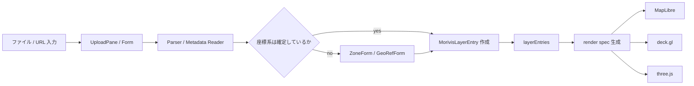
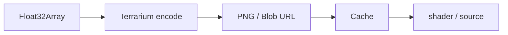

# データパイプライン

morivis では、アップロードや URL 入力で受け取ったデータを解析し、必要なら座標変換や派生処理を行ったうえで `MorivisLayerEntry` に正規化する。  
その後、`MorivisLayerEntry` を MapLibre / deck.gl / three.js 向けの描画表現へ変換して表示する。

この文書は、**入力から描画までの流れ** をまとめたもの。  
`MorivisLayerEntry` 自体の役割、分類軸、責務境界は [内部レイヤーモデル](./architecture/entry-model.md) を参照。

## 全体フロー


```mermaid
flowchart LR
	A["ファイル / URL 入力"] --> B["UploadPane / Form"]
	B --> C["Parser / Metadata Reader"]
	C --> D{"座標系は確定しているか"}
	D -- yes --> E["MorivisLayerEntry 作成"]
	D -- no --> F["ZoneForm / GeoRefForm"]
	F --> E
	E --> G["layerEntries"]
	G --> H["render spec 生成"]
	H --> I["MapLibre"]
	H --> J["deck.gl"]
	H --> K["three.js"]
```

## パイプラインの段階

morivis のデータ処理は、次の 4 段階で考えると整理しやすい。

1. 入力判定
2. 解析と座標変換
3. `MorivisLayerEntry` への正規化
4. 描画系への変換

## 1. 入力判定

`frontend/src/routes/map/components/upload/FileManager.svelte` が、ファイル種別や URL の種類から適切な Form へ振り分ける。  
単純な拡張子判定だけでなく、中身を見て判定する形式もある。

### 主な入力カテゴリ

- ベクター系
  GeoJSON, FlatGeobuf, TopoJSON, GeoParquet, GeoArrow, Shapefile, GeoPackage, GPX, KML, GML, OSM XML, CSV, DXF, DM, SIMA, 法務局地図 XML, GeoPhoto, GTFS など
- ラスター系
  GeoTIFF, DEM XML, NetCDF, GRIB2, HDF5, GeoPDF 画像, ワールドファイル付き画像, COG, WCS, GeoZarr など
- タイル / 配信系
  XYZ, WMTS, WMS, PMTiles, MBTiles, ArcGIS FeatureServer, ArcGIS MapServer, OGC API Features, WFS, STAC など
- 3D / 点群系
  GLB, OBJ, 3D Tiles, LAS, LAZ, PLY, PCD, XYZ テキストなど

### 判定の考え方

- できるだけ入力形式に合わせて専用 Form へ渡す
- 1つの拡張子でも中身で分岐するものがある
- 複数ファイルで 1 データになる形式をまとめて扱う

例:

- `.zip`
  GTFS かどうかを先に判定し、違えば展開して再判定する
- `.json`
  Location History, MF-JSON, GeoJSON を識別する
- `.xml`
  DEM XML, GML, LandXML, 法務局地図 XML を識別する
- `.obj`
  面要素があればメッシュ、頂点のみなら点群として扱う

## 2. 解析と座標変換

各 Form は、対応するパーサーやメタデータ解析器を呼び出す。  
この段階の役割は、入力をいったん扱える中間形へ変換し、必要なら座標系を確定すること。

### ベクター

多くのベクター形式は、いったん `FeatureCollection` 相当へ変換される。  
その後、ジオメトリ種別や属性を見て entry を作る。

必要なら次を行う。

- `.prj` や EPSG 情報の解釈
- Worker による WGS84 変換
- geometry ごとの分割
- temporal 属性の抽出

### ラスター

ラスターでは、画像ソースとしてそのまま扱えるものと、格子データから可視化用画像を生成するものがある。

代表的な流れ:

- GeoTIFF / COG
  geotiff.js で読み、必要なら Terrarium 化する
- DEM XML
  標高配列を作り、Terrarium 化する
- NetCDF / GRIB2 / HDF5
  指定変数や格子を取り出し、必要なら Terrarium 化する
- 画像 + sidecar
  ワールドファイルや `aux.xml` から空間参照を補う

### 3D / 点群

- メッシュモデル
  GLB / OBJ などを読み、必要なら bbox を計算する
- 3D Tiles
  `tileset.json` を entry 化する
- 点群
  LAS / LAZ / PLY / PCD / XYZ を読み、必要なら座標変換する

### ZoneForm / GeoRefForm

座標系や空間参照が自動確定できない場合は、補助 Form を挟む。

- `ZoneForm`
  投影法や EPSG をユーザーが確定する
- `GeoRefForm`
  画像のコーナー座標や bbox をユーザーが確定する

ここで確定した情報を使って、`MorivisLayerEntry` を作る前に再変換する。

## 3. MorivisLayerEntry への正規化

解析結果は、最終的に `MorivisLayerEntry` に正規化する。  
ここが morivis の内部パイプラインの中心である。

```ts
type MorivisLayerEntry =
	| MorivisVectorEntry
	| MorivisRasterEntry
	| MorivisModelEntry;
```

### Vector への正規化

ベクターは geometry ベースで次のどれかになる。

- `VectorPointEntry`
- `VectorLineEntry`
- `VectorPolygonEntry`

`format.type` は取得方式を表す。

例:

- `geojson`
- `fgb`
- `mvt`
- `pmtiles`
- `geojsontile`
- `esri-feature`
- `ogc-feature`
- `wfs-feature`

### Raster への正規化

ラスターは visualization ベースで次のどれかになる。

- `BaseMapRasterEntry`
- `CategoricalRasterEntry`
- `DemRasterEntry`
- `TiffRasterEntry`
- `CadRasterEntry`

`format.type` は配信・格納方式、`style.type` は可視化の種類を表す。

例:

- `format.type: 'image'` + `style.type: 'dem'`
- `format.type: 'cog'` + `style.type: 'tiff'`

### Model への正規化

3D 系は object / runtime ベースで次のどれかになる。

- `MeshEntry`
- `Tiles3DEntry`
- `PointCloudEntry`
- `DeckVectorEntry`

この段階で、three.js 系と deck.gl 系の分岐の元になる。

## 4. 派生処理

一部の形式は、そのまま表示するだけでなく、追加の派生処理を持つ。

### Terrarium パイプライン

標高や格子値を Web 表示しやすい形にするため、Terrarium エンコードを使う。


```mermaid
flowchart LR
	A["Float32Array"] --> B["Terrarium encode"]
	B --> C["PNG / Blob URL"]
	C --> D["Cache"]
	D --> E["shader / source"]
```

対象:

- DEM XML
- GeoTIFF
- NetCDF
- GRIB2
- 一部 HDF5

### GeoTIFF 派生量

1 バンド GeoTIFF 系は、元バンドを保持して派生量を lazy 生成する。

主な派生:

- `slope`
- `aspect`
- `tpi`
- `twi`

### ラスターから 3D メッシュ

次の入力は、ラスターだけでなく 3D メッシュにも分岐できる。

- GeoTIFF 1 バンド
- NetCDF
- DEM XML
- LandXML
- GeoRefForm 経由の 1 バンド画像

この場合、格子値から `MeshEntry` を作る。

## 5. 時間軸

時間軸は、形式ごとに別々に扱うのではなく、できるだけ共通の状態へ正規化する。

主な時間軸付き入力:

- WMS / WMTS の time dimension
- Himawari / Nowcast
- NetCDF
- GRIB2 / GPV
- 一部ベクター入力

正規化先の考え方:

- 離散的な時間選択
- 現在 index の保持
- runtime での source 差し替えまたは style 再生成

## 6. 描画系への変換

`MorivisLayerEntry` をそのまま描画するのではなく、描画系ごとの spec に変換する。

### MapLibre

主に `vector` と `raster` を受ける。

- `createSourcesItems()`
- `createLayersItems()`
- `Map.svelte` の `createMapStyle()`
- `mapStore.setStyle()`

設計上の原則は、MapLibre の生 API を命令的に触るのではなく、  
entry 配列から style 全体を再生成して反映すること。

### deck.gl

主に次を受ける。

- `Tiles3DEntry`
- `PointCloudEntry`
- `DeckVectorEntry`

### three.js

主に `MeshEntry` を受ける。  
GLB / OBJ などのモデルや、ラスター由来メッシュがここに流れる。

## 7. データパイプライン文書としての見方

この文書で大事なのは、すべての形式を個別に覚えることではない。  
morivis の入力処理が、最終的に次の流れへ収束することを押さえることが重要である。

1. 入力を判定する
2. 解析して座標系を確定する
3. `MorivisLayerEntry` に正規化する
4. 描画系ごとの spec に変換する

## 8. 補足

- 型の意味や責務境界は [内部レイヤーモデル](./architecture/entry-model.md) を参照
- 図として見る場合は `docs/architecture/diagrams/` 配下の詳細図を参照
