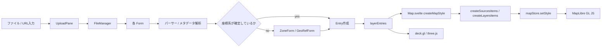

# データパイプライン

morivis では、アップロードや URL 入力で受け取ったデータを `GeoDataEntry` に正規化し、`Map.svelte` がその内容から MapLibre の `sources` と `layers` を再生成して描画する。  
この文書は、現行実装の入力判定、パーサー、座標変換、protocol、worker の流れをまとめたもの。

## 全体フロー


```mermaid
graph LR
    A[ファイル / URL入力] --> B[UploadPane]
    B --> C[FileManager]
    C --> D[各 Form]
    D --> E[パーサー / メタデータ解析]
    E --> F{座標系が確定しているか}
    F -- yes --> G[Entry作成]
    F -- no --> H[ZoneForm / GeoRefForm]
    H --> G
    G --> I[layerEntries]
    I --> J[Map.svelte createMapStyle]
    J --> K[createSourcesItems / createLayersItems]
    K --> L[mapStore.setStyle]
    L --> M[MapLibre GL JS]
    I --> N[deck.gl / three.js]
```

## 入力判定

`frontend/src/routes/map/components/upload/FileManager.svelte` がファイル種別を振り分ける。単純な拡張子判定だけでなく、いくつかの形式は中身も見ている。

### 単一ファイル

| 判定 | 遷移先 |
|---|---|
| `.geojson` `.json` `.fgb` | `GeoJsonForm` |
| `.topojson` | `TopoJsonForm` |
| `.gpx` | `GpxForm` |
| `.osm` | `OsmForm` |
| `.gml` | `GmlForm` |
| `.kml` `.kmz` | `KmlForm` |
| `.csv` | `CsvForm` |
| `.gpkg` | `GpkgForm` |
| `.pmtiles` | `PmtilesForm` |
| `.mbtiles` | `MBTilesForm` |
| `.las` `.laz` `.ply` `.pcd` `.xyz` | `PointCloudForm` |
| `.glb` `.obj` | `MeshModelForm` |
| `.nc` `.nc4` | `NetCDFForm` |
| `.grib2` `.grb2` `.grb` `.bin` | `Grib2Form` |
| `.landxml` | `LandXmlForm` |
| `.dm` `.dxf` `.sim` | 専用 Form |
| `.pdf` | `GeoPdfForm` |
| `.tif` `.tiff` `.png` `.webp` | `GeoPdfForm` |
| `.jpg` `.jpeg` `.heic` `.heif` | EXIF GPS があれば `GeoPhotoForm`、なければ `GeoPdfForm` |

### 特殊判定

| 判定 | 内容 |
|---|---|
| `.zip` | 先に GTFS ZIP を判定し、該当すれば `GtfsForm`。違う場合は展開して中のファイルを再判定する |
| `.xml` | 先頭を読んで `DEM XML` → `GML` → `LandXML` → `法務局地図XML` の順で判定する |
| 複数ファイル | Shapefile 一式、GeoTIFF + ワールドファイル、OBJ + MTL + テクスチャのまとまりとして扱う |

## 形式別パイプライン

### ベクター系ファイル

| 入力 | Form | 主な処理 | 結果 |
|---|---|---|---|
| GeoJSON / JSON | `GeoJsonForm` | JSON 解析 | `VectorEntry` `format.type: 'geojson'` |
| FlatGeobuf | `GeoJsonForm` | FlatGeobuf 読み込み | `VectorEntry` `format.type: 'fgb'` |
| TopoJSON | `TopoJsonForm` | TopoJSON を GeoJSON に変換 | `VectorEntry` `format.type: 'geojson'` |
| Shapefile | `ShapeFileForm` | `.shp` `.dbf` `.shx` を結合して GeoJSON 化 | `VectorEntry` `format.type: 'geojson'` |
| GeoPackage | `GpkgForm` | SQLite を worker で解析 | `VectorEntry` `format.type: 'geojson'` |
| GPX | `GpxForm` | track / route / waypoint を GeoJSON 化 | `VectorEntry` `format.type: 'geojson'` |
| GML | `GmlForm` | 基盤地図情報系は自前処理、汎用 GML は OpenLayers ベースで変換 | `VectorEntry` `format.type: 'geojson'` |
| KML / KMZ | `KmlForm` | KML 解析、KMZ は展開後に処理 | `VectorEntry` `format.type: 'geojson'` |
| OSM XML | `OsmForm` | `osmtogeojson` で GeoJSON 化し、ジオメトリ種別ごとに登録 | `VectorEntry` `format.type: 'geojson'` |
| CSV | `CsvForm` | 指定列から座標を作って Point 化 | `VectorEntry` `format.type: 'geojson'` |
| DXF | `DxfForm` | CAD 図面を GeoJSON 化 | `VectorEntry` `format.type: 'geojson'` |
| DM | `DmForm` | 国土地理院 DM を GeoJSON 化 | `VectorEntry` `format.type: 'geojson'` |
| SIMA | `SimaForm` | SIMA を GeoJSON 化 | `VectorEntry` `format.type: 'geojson'` |
| 法務局地図 XML | `MojXmlForm` | XML と内蔵座標系定義から GeoJSON 化 | `VectorEntry` `format.type: 'geojson'` |
| GeoPhoto | `GeoPhotoForm` | EXIF GPS を Point に変換 | `VectorEntry` `format.type: 'geojson'` |
| GTFS ZIP | `GtfsForm` | ZIP を解析し、停留所または路線を GeoJSON 化 | `VectorEntry` `format.type: 'geojson'` |
| GeoPDF 内蔵ベクター | `GeoPdfForm` | worker でベクター抽出 | `VectorEntry` `format.type: 'geojson'` |

### ラスター系ファイル

| 入力 | Form | 主な処理 | 結果 |
|---|---|---|---|
| GeoTIFF | `GeoTiffForm` | geotiff.js で読んで Terrarium へエンコード | `RasterEntry` `format.type: 'image'` + `style.type: 'tiff'` |
| PNG / JPEG / WebP + ワールドファイル | `GeoTiffForm` | ジオリファレンス情報を使って画像登録 | `RasterEntry` `format.type: 'image'` |
| GeoPDF 画像 | `GeoPdfForm` | 画像化し、必要なら手動ジオリファレンス | `RasterEntry` `format.type: 'image'` |
| NetCDF | `NetCDFForm` | バンドを読み、Terrarium 化 | `RasterEntry` `format.type: 'image'` + `style.type: 'tiff'` |
| DEM XML | `DemXmlForm` | XML を worker 並列解析して標高配列を作る | `RasterEntry` `format.type: 'image'` + `style.type: 'tiff'` |
| GRIB2 | `Grib2Form` | 気象格子を読み、Terrarium 化 | `RasterEntry` `format.type: 'image'` + `style.type: 'tiff'` |
| HDF5 | `Hdf5Form` | HDF5 を読み、バンドを Terrarium 化 | `RasterEntry` `format.type: 'image'` + `style.type: 'tiff'` |
| LandXML | `LandXmlForm` | TIN を worker でラスタライズして Terrarium 化 | `RasterEntry` `format.type: 'image'` + `style.type: 'tiff'` |

### タイル・リモート配信

| 入力 | Form | 主な処理 | 結果 |
|---|---|---|---|
| XYZ ラスター URL | `RasterForm` | URL と tileSize を設定 | `RasterEntry` `format.type: 'image'` |
| XYZ DEM URL | `RasterForm` | `createDemRasterEntry` で登録 | `RasterEntry` `format.type: 'image'` + `style.type: 'dem'` |
| WMTS / WMS URL | `WmtsForm` | capabilities を読んでタイル URL を組み立てる | `RasterEntry` `format.type: 'image'` |
| PMTiles | `PmtilesForm` | メタデータを読んで vector / raster を判定 | `VectorEntry` or `RasterEntry` `format.type: 'pmtiles'` |
| MBTiles | `MBTilesForm` | ファイル解析後、vector / raster を判定 | `VectorEntry` or `RasterEntry` `format.type: 'mbtiles'` |
| ベクタータイル URL | `VectorForm` | MVT か GeoJSON Tile かを選んで登録 | `VectorEntry` `format.type: 'mvt'` or `geojsontile` |
| ArcGIS FeatureServer | `ArcGisForm` | レイヤー情報を取得し、bbox クエリ用 entry を作る | `VectorEntry` `format.type: 'esri-feature'` |
| ArcGIS MapServer | `ArcGisForm` | タイル URL を組み立てる | `RasterEntry` `format.type: 'image'` |
| STAC / COG URL | `StacForm` | 小さい画像は全体読込、大きい画像は COG タイル配信 | `RasterEntry` `format.type: 'image'` or `'cog'` |

### 3D・点群

| 入力 | Form | 主な処理 | 結果 |
|---|---|---|---|
| GLB / OBJ | `MeshModelForm` | メッシュとして登録 | `ModelEntry` |
| 3D Tiles URL | `Tiles3DForm` | `tileset.json` を登録 | `ModelEntry` |
| LAS / LAZ / PLY / PCD / XYZ | `PointCloudForm` | 点群を読み、必要なら座標変換 | `ModelEntry` |

## 座標変換と補助フォーム

### ZoneForm

ベクターや点群でバウンディングボックスが不正な場合は、自動登録せず `ZoneForm` に遷移する。  
確定後は `transformGeoJSONParallel()` または点群用 transformer worker で WGS84 に変換してから entry を作る。

### GeoRefForm

GeoPDF や画像系で空間参照が足りない場合は `GeoRefForm` を使う。  
ここで確定したコーナー座標や bbox が `metaData.imageCorners` や bounds に入る。

## Entry とソース生成

`Map.svelte` は `layerEntries` と preview 対象から `createMapStyle()` を実行し、`createSourcesItems()` と `createLayersItems()` に委譲する。

### VectorEntry

| format.type | MapLibre source |
|---|---|
| `geojson` `fgb` | `GeoJSONSource` |
| `mvt` | `VectorSource` |
| `pmtiles` | `VectorSource` |
| `mbtiles` | `VectorSource` |
| `geojsontile` | `VectorSource` |
| `esri-feature` | `VectorSource` |

### RasterEntry

| format.type | style.type | MapLibre source |
|---|---|---|
| `image` | `tiff` | `ImageSource` |
| `image` | `dem` | `RasterSource` |
| `image` | その他 | `RasterSource` |
| `pmtiles` | `dem` 以外 | `RasterSource` |
| `pmtiles` | `dem` | `RasterSource` |
| `mbtiles` | raster | `RasterSource` |
| `cog` | `tiff` | `RasterSource` |

### ModelEntry

- 3D Tiles と点群は deck.gl overlay で描画する
- GLB / OBJ は three.js のカスタムレイヤーで描画する

## カスタム protocol

`frontend/src/routes/stores/map.ts` で `MapLibre.addProtocol()` を管理している。

| protocol | 用途 | 実装 | 登録タイミング |
|---|---|---|---|
| `pmtiles://` | PMTiles の読み出し | `pmtiles` ライブラリ | 起動時に常時登録 |
| `webgl://` | DEM タイルの陰影・傾斜・方位・曲率レンダリング | `protocol/raster` | DEM 利用時に登録 |
| `cog://` | COG のタイルレンダリング | `protocol/cog` | COG 利用時に登録 |
| `mbtiles://` | MBTiles ファイルのタイル配信 | `protocol/mbtiles` | MBTiles 利用時に登録 |
| `geojson://` | GeoJSON タイル化 | `protocol/vector/geojson` | GeoJSON タイル利用時に登録 |
| `esri-feature://` | ArcGIS FeatureServer を bbox 単位でタイル化 | `protocol/vector/esri-feature` | ArcGIS vector 利用時に登録 |
| `tile_index://` | XYZ タイル境界の可視化 | `protocol/vector/tileindex` | タイル索引表示時に登録 |

`terrain` protocol はソースコードに残っているが、現在は停止している。

## Worker 一覧

| Worker | パス | 用途 |
|---|---|---|
| `transformer` | `frontend/src/routes/map/utils/proj/transformer.worker.ts` | GeoJSON 座標変換 |
| `pointcloud_transformer` | `frontend/src/routes/map/utils/proj/pointcloud_transformer.worker.ts` | 点群座標変換 |
| `gpkg` | `frontend/src/routes/map/utils/formats/gpkg/gpkg.worker.ts` | GeoPackage 解析 |
| `xml-parser` | `frontend/src/routes/map/utils/formats/dem-xml/xml-parser.worker.ts` | DEM XML 解析 |
| `terrarium_encode` | `frontend/src/routes/map/utils/formats/geotiff/terrarium_encode.worker.ts` | バンド値から Terrarium PNG を生成 |
| `terrarium_render` | `frontend/src/routes/map/utils/formats/geotiff/terrarium_render.worker.ts` | Terrarium PNG の描画と再投影 |
| `landxml rasterize` | `frontend/src/routes/map/utils/formats/landxml/rasterize.worker.ts` | TIN のラスタライズ |
| `geopdf vector-parse` | `frontend/src/routes/map/utils/formats/geopdf/vector-parse.worker.ts` | GeoPDF 内蔵ベクター抽出 |
| `protocol_geojson` | `frontend/src/routes/map/protocol/vector/geojson/protocol_geojson.worker.ts` | GeoJSON のベクタータイル化 |
| `protocol_esri_feature` | `frontend/src/routes/map/protocol/vector/esri-feature/protocol_esri_feature.worker.ts` | ArcGIS PBF のデコードとタイル化 |
| `tile_index` | `frontend/src/routes/map/protocol/vector/tileindex/tile_index.worker.ts` | タイル index 表示用 GeoJSON 生成 |
| `protocol_dem` | `frontend/src/routes/map/protocol/raster/protocol_dem.worker.ts` | DEM タイルの WebGL レンダリング |
| `protocol_cog` | `frontend/src/routes/map/protocol/cog/protocol_cog.worker.ts` | COG タイルの描画 |
| `generation_icon` | `frontend/src/routes/map/utils/icon/generation_icon.worker.ts` | POI アイコン生成 |

## スタイル更新フロー

このプロジェクトでは、MapLibre のレイヤーを直接つまむより `mapStore.setStyle()` でスタイルを作り直す流れを基本にしている。

```text
入力データや表示設定の変更
  ↓
Map.svelte のリアクティブ処理
  ↓
createMapStyle()
  ↓
createSourcesItems() / createLayersItems()
  ↓
setStyleDebounce()
  ↓
mapStore.setStyle()
  ↓
MapLibre が差分適用
```

補足:

- preview 中は `showDataEntry` 用の source/layer だけを別系統で生成する
- deck.gl overlay と three.js レイヤーは MapLibre の style とは別に管理する
- `showXYZTileLayer` が有効なときだけ `tile_index://` source を追加する
