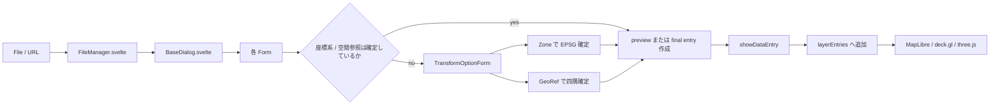
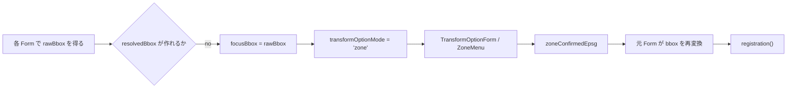
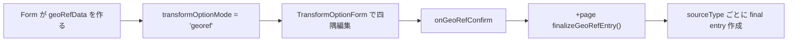
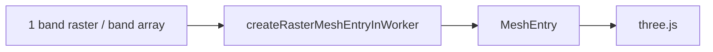
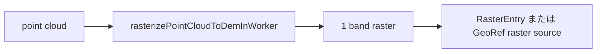
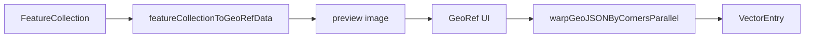

# データパイプライン

morivis では、ファイルや URL から受け取ったデータを解析し、必要なら座標系を確定し、`MorivisLayerEntry` に正規化してから描画系へ渡す。  
この文書は、実装上の責務分担と状態遷移を追えるように、アップロード導線を中心に整理したもの。

`MorivisLayerEntry` 自体の役割と責務境界は [内部レイヤーモデル](./architecture/entry-model.md) を参照。

## 全体像

```mermaid
flowchart LR
	A["File / URL"] --> B["FileManager.svelte"]
	B --> C["BaseDialog.svelte"]
	C --> D["各 Form"]
	D --> E{"座標系 / 空間参照は確定しているか"}
	E -- yes --> F["preview または final entry 作成"]
	E -- no --> G["TransformOptionForm"]
	G --> H["Zone で EPSG 確定"]
	G --> I["GeoRef で四隅確定"]
	H --> F
	I --> F
	F --> J["showDataEntry"]
	J --> K["layerEntries へ追加"]
	K --> L["MapLibre / deck.gl / three.js"]
```

## 入口

アップロード系の入口は次の 3 層で分かれる。

| 層 | 主な責務 |
| --- | --- |
| `FileManager.svelte` | 入力ファイル群の種別判定。単体ファイルか複数ファイルか、sidecar の組み合わせが正しいかを判断する。 |
| `BaseDialog.svelte` | `showDialogType` に応じて各 Form を切り替える。共通状態を bind で各 Form に渡す。 |
| `components/upload/form/*.svelte` | 形式ごとの解析、座標系判定、preview 準備、最終 entry 作成を担当する。 |

## 中間状態

アップロード導線で頻出する状態は次の通り。

| 状態 | 置き場所 | 役割 |
| --- | --- | --- |
| `showDialogType` | `+page.svelte` | 今どの Form を開いているか。 |
| `dropFile` | `+page.svelte` | 現在処理中のファイルまたはファイル群。 |
| `showDataEntry` | `+page.svelte` | preview 中または直近に確定した `MorivisLayerEntry`。 |
| `focusBbox` | `+page.svelte` | Zone UI で候補 EPSG を可視化する元 bbox。 |
| `selectedEpsgCode` | `+page.svelte` | Zone UI で現在選択中の EPSG。 |
| `zoneConfirmedEpsg` | `+page.svelte` | Zone UI で確定した EPSG。各 Form 側がこれを受けて再変換する。 |
| `transformOptionMode` | `+page.svelte` | `zone` / `georef` / `null`。補助 UI の現在モード。 |
| `pendingZoneGeoRefData` | `+page.svelte` | ベクターを Zone のあと GeoRef に回すときの一時データ。 |
| `geoRefData` | `+page.svelte` | GeoRef UI に渡す共通データ。ラスター、ベクター、点群をここに乗せる。 |
| `geoRefPreviewData` | `+page.svelte` | GeoRef 中のプレビュー四隅と画像 URL。 |
| `rawBbox` | 各 Form | 元データが持っていた bbox。まだ WGS84 に確定していない場合がある。 |
| `resolvedBbox` | 各 Form | そのまま entry に使える bbox。 |

## 分岐

アップロード後の分岐は、大きく 4 つある。

| 分岐 | 条件 | 次の責務 |
| --- | --- | --- |
| そのまま登録 | `resolvedBbox` がある、または座標系確定済み | Form 内で final entry を作る。 |
| Zone へ進む | `rawBbox` はあるが `resolvedBbox` がまだない | `TransformOptionForm` で EPSG を確定し、元 Form に戻して再変換する。 |
| GeoRef へ進む | bbox が無い、または四隅で位置合わせしたい | `geoRefData` を作り、`TransformOptionForm` を `georef` で開く。 |
| preview のみ作る | ベクター GeoRef、点群 GeoRef、画像 GeoRef の準備段階 | `showDataEntry` ではなく `geoRefPreviewData` を更新する。 |

## 形式別フロー

代表的な形式の流れを表にまとめる。

| 形式 | 解析 | bbox の由来 | 座標系確定 | preview 作成 | final entry 作成 | worker |
| --- | --- | --- | --- | --- | --- | --- |
| GeoJSON / TopoJSON / WKT / GML / MIF / OSM / CSV / TSV | 各 `Form` で `FeatureCollection` 化 | `turfBbox` 等 | bbox が不正なら Zone | GeoRef 用は `featureCollectionToGeoRefData()` | 各 Form または `+page finalizeGeoRefEntry()` | 座標変換、GeoRef ベクター変形 |
| Shapefile / GeoPackage / GeoParquet | パーサーで `FeatureCollection` 化 | 解析結果 | `.prj` 等で自動、足りなければ Zone | 必要なら vector→GeoRef 用ラスター化 | 各 Form または `+page finalizeGeoRefEntry()` | 解析、座標変換 |
| DXF / DM / SIMA / MojXML | 独自パーサーで `FeatureCollection` 化 | 解析結果 | 多くは Zone 必須 | 必要なら vector→GeoRef 用ラスター化 | 各 Form または `+page finalizeGeoRefEntry()` | 解析、座標変換 |
| GeoTIFF / 画像 + `tfw` / 画像 + `aux.xml` | `GeoTiffForm.svelte` | 埋め込み bbox、`tfw`、`aux.xml` | bbox がそのまま有効なら直行。`aux.xml` の EPSG があれば自動変換。足りなければ Zone。bbox 自体が無ければ GeoRef。 | `createRasterGeoRefData()` | `GeoTiffForm.svelte` または `+page finalizeGeoRefEntry()` | GeoTIFF 解析、bbox 変換、3Dメッシュ化 |
| DEM XML / NetCDF / GRIB2 / GeoPDF / LandXML | 形式ごとの解析でバンド配列化 | 解析結果や補助メタデータ | 形式ごとに自動または Zone | `createRasterGeoRefData()` | 各 Form または `+page finalizeGeoRefEntry()` | 解析、Terrarium、3Dメッシュ化 |
| 点群 LAS / LAZ / PLY / PCD / XYZ / OBJ 点群 | `PointCloudForm.svelte` | 点群 positions の bbox | bbox が不正なら Zone。登録方法により raster / pointcloud へ分岐。 | 点群のまま GeoRef する場合は point cloud 用 `geoRefData`。DEM 化する場合は raster 用 `geoRefData`。 | `PointCloudForm.svelte` または `+page finalizeGeoRefEntry()` | 解析、座標変換、DEM ラスタライズ、GeoRef 点群変形 |
| GLB / IFC / DAE / 3DS / FBX / 3DM / 3MF / AMF | `glb` 系 Form と three.js 補助 | モデル bounds 計算 | モデル種別ごとの実装に依存 | なし | モデル entry を直接作る | bounds 計算 |

## TransformOptionForm の責務

`TransformOptionForm.svelte` は final entry を作らない。ここは補助 UI であり、責務は次の 2 つだけ。

1. `zone`
EPSG 候補を可視化し、`zoneConfirmedEpsg` または `onZoneGeoRef` へ返す。

2. `georef`
四隅を動かして `GeoRefConfirmPayload` を作り、`onGeoRefConfirm` へ返す。

重要なのは、GeoRef 確定後の final entry 作成が `TransformOptionForm` ではなく `+page.svelte` の `finalizeGeoRefEntry()` に集約されている点である。

## final entry を作る場所

この一覧を押さえておくと、フローの追跡がかなり楽になる。

| entry 種別 | どこで作るか |
| --- | --- |
| 通常ベクター entry | 各ベクター Form |
| 通常ラスター entry | 各ラスター Form |
| 通常点群 entry | `PointCloudForm.svelte` |
| 通常メッシュモデル entry | 各 3D Form |
| GeoRef 後のベクター entry | `+page.svelte` の `finalizeGeoRefEntry()` |
| GeoRef 後の点群 entry | `+page.svelte` の `finalizeGeoRefEntry()` |
| GeoRef 後のラスター entry | `+page.svelte` の `finalizeGeoRefEntry()` |
| GeoRef 後の 1 バンド→3Dメッシュ entry | `+page.svelte` の `finalizeGeoRefEntry()` |

## Zone フロー

Zone フローは「bbox はあるが、どの投影法か分からない」ケースで使う。

```mermaid
flowchart LR
	A["各 Form で rawBbox を得る"] --> B{"resolvedBbox が作れるか"}
	B -- no --> C["focusBbox = rawBbox"]
	C --> D["transformOptionMode = 'zone'"]
	D --> E["TransformOptionForm / ZoneMenu"]
	E --> F["zoneConfirmedEpsg"]
	F --> G["元 Form が bbox を再変換"]
	G --> H["registration()"]
```

ベクターの一部では、Zone 確定後にそのまま entry を作らず、`pendingZoneGeoRefData` を使って GeoRef 側へ流す経路もある。

## GeoRef フロー

GeoRef フローは「画像として四隅位置合わせをしたい」ケースで使う。  
入力の実体は 3 種類ある。

| `GeoRefData.sourceType` | 意味 |
| --- | --- |
| `raster` | 画像や 1 バンド格子を四隅で配置する。 |
| `vector` | 一度ラスター preview を作り、確定時に元 GeoJSON を四隅変形する。 |
| `pointcloud` | 一度 preview 画像を作るが、確定時は点群 positions を四隅変形する。 |

```mermaid
flowchart LR
	A["Form が geoRefData を作る"] --> B["transformOptionMode = 'georef'"]
	B --> C["TransformOptionForm で四隅編集"]
	C --> D["onGeoRefConfirm"]
	D --> E["+page finalizeGeoRefEntry()"]
	E --> F["sourceType ごとに final entry 作成"]
```

## 2D → 3D 変換

morivis では 2D データから 3D 表現を作る経路が複数ある。

### 1. 1 バンドラスター → 3D メッシュ

対象:

- GeoTIFF 1 バンド
- DEM XML
- NetCDF
- LandXML の DEM 化結果
- GeoRef 後の 1 バンド画像
- 点群を DEM ラスター化した結果

主な流れ:

```mermaid
flowchart LR
	A["1 band raster / band array"] --> B["createRasterMeshEntryInWorker"]
	B --> C["MeshEntry"]
	C --> D["three.js"]
```

### 2. 点群 → DEM ラスター

これは厳密には 2D ではなく 3D 点群から 2.5D 格子を作る経路だが、UI 上は「2D ラスターを作る」操作になる。

主な流れ:

```mermaid
flowchart LR
	A["point cloud"] --> B["rasterizePointCloudToDemInWorker"]
	B --> C["1 band raster"]
	C --> D["RasterEntry または GeoRef raster source"]
```

### 3. ベクター → GeoRef 用プレビュー画像

これは final entry 自体はベクターのままだが、一時的に 2D ラスター化して GeoRef UI に渡している。

主な流れ:

```mermaid
flowchart LR
	A["FeatureCollection"] --> B["featureCollectionToGeoRefData"]
	B --> C["preview image"]
	C --> D["GeoRef UI"]
	D --> E["warpGeoJSONByCornersParallel"]
	E --> F["VectorEntry"]
```

## 3D → 2D 変換

### 1. 点群 → DEM ラスター

3D 点群を 1 バンド DEM ラスターへ変換する。  
これは現在もっとも明示的な 3D → 2D 変換フローで、`PointCloudForm.svelte` の登録方法で `raster` を選んだときに使う。

### 2. LandXML サーフェス → DEM ラスター

TIN サーフェスを DEM に焼き直して 2D ラスターとして扱う。  
同じ入力から `mesh` を選べば 3D、`dem` を選べば 2D になる。

## worker 境界

重い処理はなるべく worker に逃がしている。設計上ここを明示しておくと、フリーズ調査がしやすい。

| 処理 | 主な実装 |
| --- | --- |
| GeoTIFF 解析 | `utils/formats/geotiff/analyze.worker.ts` |
| bbox 座標変換 | `utils/proj/transform-bbox.ts` 経由の worker |
| ベクター座標変換 | `transformGeoJSONParallel()` |
| 点群座標変換 | `transformPointCloudParallel()` |
| GeoRef ベクター変形 | `warpGeoJSONByCornersParallel()` |
| GeoRef 点群変形 | `warpPointCloudByCornersParallel()` |
| 1 バンドラスター→3Dメッシュ | `createRasterMeshEntryInWorker()` |
| 点群→DEM ラスタライズ | `rasterizePointCloudToDemInWorker()` |
| GPKG / GML / DXF / DM などの解析 | 形式ごとの worker 実装 |
| uploaded 3D model の bounds 計算 | `model-bounds-parallel` 系 |

main thread に残っている責務は、主に次の通り。

- UI 状態管理
- `showDataEntry` の更新
- `transformOptionMode` の切り替え
- 軽いメタデータ判定
- 描画エンジンへの反映

## preview と final の違い

morivis では preview と final entry を分けて考える必要がある。

| 段階 | 主な状態 |
| --- | --- |
| preview | `geoRefPreviewData`, `geoRefData`, `showDialogType`, `transformOptionMode` |
| final | `showDataEntry` |

特に GeoRef 系では、「preview 画像を作るコンポーネント」と「最終 entry を作るコンポーネント」が別である。

- preview を準備するのは各 Form
- 四隅を編集するのは `TransformOptionForm`
- final entry を作るのは `+page.svelte`

## 実装を見る順番

フローを追うときは、次の順で見ると混乱しにくい。

1. `FileManager.svelte`
2. `BaseDialog.svelte`
3. 対象 `Form`
4. `TransformOptionForm.svelte`
5. `+page.svelte` の `finalizeGeoRefEntry()` と `openPendingZoneGeoRef()`

## 関連

- 型と責務境界: [内部レイヤーモデル](./architecture/entry-model.md)
- 地図スタイル反映: `Map.svelte`, `stores/map.ts`
