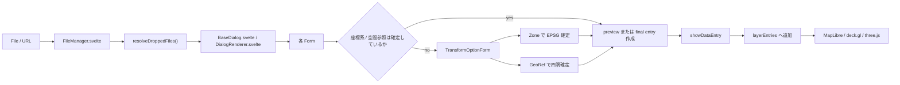
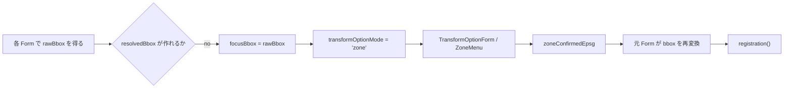
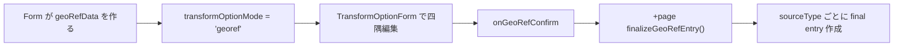
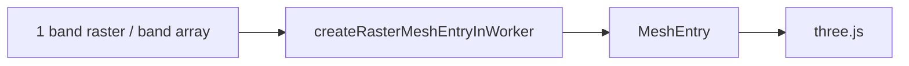
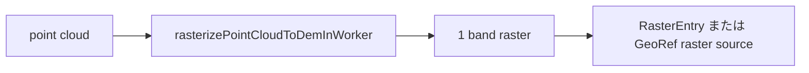
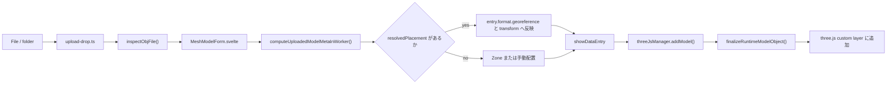

# データパイプライン

morivis では、ファイルや URL から受け取ったデータを解析し、必要なら座標系を確定し、`MorivisLayerEntry` に正規化してから描画系へ渡す。  
この文書は、実装上の責務分担と状態遷移を追えるように、アップロード導線を中心に整理したもの。

`MorivisLayerEntry` 自体の役割と責務境界は [内部レイヤーモデル](./architecture/entry-model.md) を参照。

## 全体像

```mermaid
flowchart LR
	A["File / URL"] --> B["FileManager.svelte"]
	B --> C["resolveDroppedFiles()"]
	C --> D["BaseDialog.svelte / DialogRenderer.svelte"]
	D --> E["各 Form"]
	E --> F{"座標系 / 空間参照は確定しているか"}
	F -- yes --> G["preview または final entry 作成"]
	F -- no --> H["TransformOptionForm"]
	H --> I["Zone で EPSG 確定"]
	H --> J["GeoRef で四隅確定"]
	I --> G
	J --> G
	G --> K["showDataEntry"]
	K --> L["layerEntries へ追加"]
	L --> M["MapLibre / deck.gl / three.js"]
```

## 入口

アップロード系の入口は次の 4 層で分かれる。

| 層 | 主な責務 |
| --- | --- |
| `FileManager.svelte` | 入力ファイル群や URL を受け取り、`resolveDroppedFiles()` に渡す。大容量ファイル確認や remote KML model の即時登録もここで扱う。 |
| `upload-drop.ts` / `upload-drop-matchers.ts` | 拡張子、複数ファイル組み合わせ、ZIP 展開後の中身、XML 先頭内容を見て `DialogType` を決める。 |
| `BaseDialog.svelte` / `DialogRenderer.svelte` | `showDialogType` と `dialog-registry.ts` をもとに対象 Form を選び、profile に応じて必要な bind 状態を渡す。 |
| `components/upload/form/*.svelte` | 形式ごとの解析、座標系判定、preview 準備、最終 entry 作成を担当する。 |

### TIFF URLの自動振り分け

共通URL欄では `upload-url.ts` が `.tif` / `.tiff` / `.geotiff` をサービス問い合わせより先に判定する。タイルURLテンプレートは既存のタイル登録を優先する。
`geotiff/probe-cog.ts` が64 KiB単位のRange取得で位置情報・内部タイル・縮小画像を調べ、COG登録に適する場合は `remote-stac` profileで `StacForm.svelte` にURLを渡す。画素の復号は判定時には行わず、取得量4 MiB・待ち時間20秒・後続IFD 16個までに制限する。これはOGCの完全なCOG適合性検査ではない。

通常TIFFやRange非対応（HTTP 200）は従来のファイル取得へ進む。通信失敗、不正な部分応答、判定上限超過ではエラーを表示し、全体取得へ自動で切り替えない。COG登録へ進んだ後にプレビュー用画素を取得し、最小オーバービューの中央から最大512×512画素を読む。サムネイルと初期の値域はその標本に基づく。

## 定義元

対応形式が増えたので、どこを真実の定義として見るかを明示しておく。

| ファイル | 役割 |
| --- | --- |
| `utils/formats/<format>/definition.ts` | 拡張子・関連ファイル構成・容量や処理量の制限。UIやパーサーを読み込まない静的定義。 |
| `utils/formats/registry.ts` | 形式IDから定義を引く対応表。全形式を集める。 |
| `types/index.ts` | `DialogType` と形式の表示名・説明・アイコン・表示順・入力フォーム。技術定義から拡張子を取得して `SUPPORTED_UPLOAD_FORMATS`・`SUPPORTED_FILE_GROUPS`・ファイル選択用一覧を生成する。 |
| `upload-drop.ts` | ファイルや URL をどの `DialogType` に振り分けるかの定義元。OBJ の軽量事前検査結果のような形式別メタデータもここで `File` に一時付与する。 |
| `dialog-registry.ts` | `DialogType -> Form の動的 import / profile` の対応表。 |
| `transform-policy.ts` | 形式ごとの `zone` / `georef` 許可方針。 |
| `components/upload/form/*.svelte` | 各形式の preview / final entry 作成の実装本体。 |

## 容量・処理量の制限

形式ごとの上限は `utils/formats/<format>/definition.ts` の `limits` に置く。
`utils/formats/resource-limits.ts` は共通の容量警告の閾値・検査関数・入力上限の型を持ち、形式別の数値表は持たない。

UIの表示項目は既存の形式IDで `FORMAT_DEFINITIONS` を参照する。`resourceLimitKeys` による別表との手書きの対応付けは不要。
フォームを共用するOSM XML/PBF、JWW/JWC、SQLite/SQLダンプ、点群/E57では、制限を持つ形式の定義を `variants` で参照する。
親項目に子形式の上限を適用しない。Workerやパーサーは必要な `definition.ts` だけを直接importし、全形式のレジストリやUIの表示情報を読み込まない。

`extensions` は形式一覧からのファイル選択に使う拡張子。`files` は関連ファイルを扱う既存リゾルバーの構成情報で、必須・任意・本体・属性ファイルなどを区別する。
例えばShapefileの拡張子は必須3ファイルと任意のPRJ/CPGから生成し、ファイル判定も同じ定義を参照する。
TABのヘッダー参照や、OSM PBFとMVTを区別する内容判定などの処理は各形式の実装に残す。拡張子一覧だけで形式を確定しない。

アイコン・説明文・表示順は `types/index.ts`、フォームの動的importは `dialog-registry.ts` に残す。
技術定義はこれらを参照せず、UIから技術定義へ一方向に依存する。

- `maxFileBytes`: ファイル単体の上限。
- `maxDatasetBytes`: 関連ファイルを合わせた一式の上限。MapInfo TABはTAB・DAT/DBF・MAP・ID・任意のINDを合計する。
- `maxBatchBytes` / `maxFiles`: 今回処理する全体の容量・ファイル数。BDSとGCDはこの単位で制限する。
- 展開後のバイト数・地物数・点数・サンプル数・時間は、それぞれのパーサーで同じ定義を参照して検査する。
- `maxTextLength` はUTF-16コード単位の文字列長。入力ファイルのバイト数とは異なる。
- 上限の未指定は、明示的な拒否基準がないことを示す。大容量でも処理できるという保証ではない。
- 形式仕様に由来するヘッダー長などの検証や、ここに移していない構造上の制約は各パーサーに残る。

`checkInputResourceLimits()` は、呼び出し元が組み立てたデータセットをファイル単位・一式・全体の順で検査する。
上限ちょうどは許可し、超過時に拒否する。上限値は集約前から変更していない。

合計100 MiB以上の続行確認は `components/upload/upload-resource-check.ts` が担当する。
MCAのみの入力と、必要なタイルを読むフォルダ入力は共通警告を省略する。この免除は各形式の強制上限とは独立している。
同じFileオブジェクトの一式で承認済みなら再確認せず、追加・差し替え後には再確認する。

Shapefileは同じ相対フォルダ・基本名を一式として扱う。ZIP内の別フォルダにある同名ファイルや、複数セット、同じ拡張子の重複は混ぜない。
フォームへの段階的な追加と同じ構成ファイルの差し替えは許可する。解析直前にも確定した一式を検査する。
Shapefileに新しい強制容量上限は設けていない。

通常のZIPアップロードは、展開前の圧縮ファイルに加え、展開後のFile配列でも共通警告を行う。
キャンセル時はフォームへ進まない。展開後の確認なので、展開中のメモリ使用量を抑える仕組みではない。

## S-57の電子海図

`.000`の基本セルは専用Workerで自動解析し、地物分類・図形種別を選んで通常のvector entryへ変換する。
接続点とエッジから線・穴付き面を復元し、測深値はPointの`DEPTH`属性として保持する。座標はWGS84の経緯度を使用する。
`.000`と同じパス・基本名の`.001`以降を一式にし、版・更新番号・レコード版を照合して差分を順番に適用する。ZIP内の一式も同じ導線を使う。更新単独や途中の欠落、セル名・版の不一致は登録を止める。S-52の海図表現は再現しない。
詳細な対応範囲と制限は[パーサーのREADME](../frontend/src/routes/map/utils/formats/s57/README.md)を参照。

## 読み込みのタイミング

PC・モバイルとも、`showDialogType` が設定されたときに `BaseDialog` を読み込む。
`dialog-registry.ts` の `load` は対象フォームだけを動的 import し、Shapefile の専用画面も同様に必要時に読み込む。
`GeoRefForm` は `transformOptionMode` が設定されたときに読み込む。
`LazyUploadComponent` が読み込み中のキャンセル、失敗時の再試行を扱う。

写真の GPS 判定では HEIC デコーダーを読み込まない。画像の先頭 12 バイトで HEIC を判定し、GPS 付き HEIC を表示用に変換するときだけ `heic-to` を読み込む。

PWA は `scripts/pwa-precache.ts` で起動エントリの静的依存をたどり、遅延 JS と変換用 Worker・WASM を事前キャッシュから除外する。
ハッシュ付きの遅延モジュールは、Service Worker の制御下で使用した時点でキャッシュする。
未使用の形式を初めて開くときは通信が必要になる。

## 中間状態

アップロード導線で頻出する状態は次の通り。

| 状態 | 置き場所 | 役割 |
| --- | --- | --- |
| `showDialogType` | `+page.svelte` | 今どの Form を開いているか。 |
| `dropFile` | `+page.svelte` | 現在処理中のファイルまたはファイル群。 |
| `showDataEntry` | `+page.svelte` | preview 中または直近に確定した `MorivisLayerEntry`。 |
| `focusBbox` | `+page.svelte` | Zone UI で候補 EPSG を可視化する元 bbox。 |
| `selectedEpsgCode` | `+page.svelte` | Zone UI で現在選択中の EPSG。 |
| `zoneConfirmedEpsg` | `+page.svelte` | Zone UI で確定した EPSG。各 Form 側がこれを受けて再変換する。 |
| `transformOptionMode` | `+page.svelte` | `zone` / `georef` / `null`。補助 UI の現在モード。 |
| `pendingZoneGeoRefData` | `+page.svelte` | ベクターを Zone のあと GeoRef に回すときの一時データ。 |
| `geoRefData` | `+page.svelte` | GeoRef UI に渡す共通データ。ラスター、ベクター、点群をここに乗せる。 |
| `geoRefPreviewData` | `+page.svelte` | GeoRef 中のプレビュー四隅と画像 URL。 |
| `rawBbox` | 各 Form | 元データが持っていた bbox。まだ WGS84 に確定していない場合がある。 |
| `resolvedBbox` | 各 Form | そのまま entry に使える bbox。 |

一部の形式では、dialog を開く前の軽量な判定結果を `File` 自体に一時保持する。  
OBJ の `morivisProjectedModelEpsg` はその代表例で、`upload-drop.ts` で付与し、`MeshModelForm.svelte` がそのまま引き継ぐ。

## 分岐

アップロード後の分岐は、大きく 4 つある。

| 分岐 | 条件 | 次の責務 |
| --- | --- | --- |
| そのまま登録 | `resolvedBbox` がある、または座標系確定済み | Form 内で final entry を作る。 |
| Zone へ進む | `rawBbox` はあるが `resolvedBbox` がまだない | `TransformOptionForm` で EPSG を確定し、元 Form に戻して再変換する。 |
| GeoRef へ進む | bbox が無い、または四隅で位置合わせしたい | `geoRefData` を作り、`TransformOptionForm` を `georef` で開く。 |
| preview のみ作る | ベクター GeoRef、点群 GeoRef、画像 GeoRef の準備段階 | `showDataEntry` ではなく `geoRefPreviewData` を更新する。 |

## 形式別フロー

VTK（`.vtk` / `.vtp` / `.vtu` / `.vti` / `.vtr` / `.vts`）は `VtkForm.svelte` からWorkerで解析する。表面メッシュ・構造格子・対応する2次セルの外表面を取り出し、同一XML内の複数Pieceを統合する。2次曲面を補間して三角形へ分割し、選択した点・セルのスカラー値を頂点色へ変換する。単位・上方向を補正したGLBを `MeshModelForm.svelte` に渡し、既存の座標系選択・位置合わせを経て `MeshEntry` へ登録する。色分けは取り込み時に確定する。対応範囲と制限は [VTK](../frontend/src/routes/map/utils/formats/vtk/README.md) を参照。

Zarr / GeoZarrは共通URL欄または `GeoZarrForm.svelte` で配列を選び、`RasterGeoZarrEntry` に登録する。
メタ情報取得・チャンク展開・タイル描画は専用Workerで処理する。座標軸の向きと元の投影を保持してMapLibreの画素中心へ再サンプリングし、取得共有・キャンセル・容量上限をruntime内で管理する。
対応範囲は [Zarr / GeoZarr](../frontend/src/routes/map/utils/formats/geozarr/README.md) を参照。

OSM PBF（`.osm.pbf`、OSMヘッダーを持つ`.pbf`）は、MVT判定より先にOSMフォームへ振り分ける。
専用Workerで`@osmix/pbf`によるデコードと`osmtogeojson`による図形組み立てを行い、WGS84のGeoJSONへ変換する。GDALは使わず、OSM XMLとジオメトリ選択・ベクター登録を共用する。
容量上限と対応範囲は [OSM PBF](../frontend/src/routes/map/utils/formats/osm-pbf/README.md) を参照。

GeoJSONSeq / 行区切りGeoJSONは専用パーサーでFeatureCollectionへまとめ、既存の `GeoJsonForm.svelte` へ接続する。
改行区切りとRFC 8142のRS区切りを扱い、ジオメトリ選択・座標変換・位置合わせ・2D/3D登録をGeoJSONと共用する。
対応範囲とメモリ上の制約は [GeoJSONSeq](../frontend/src/routes/map/utils/formats/geojsonseq/README.md) を参照。

FIT (`.fit`) は `FitForm.svelte` から専用WorkerでGPS記録を解析する。軌跡・計測点・コースポイントを選び、WGS84のGeoJSONを通常のvector entryとして登録する。座標系指定は不要で、解析・登録中はスクリーンガードを表示する。対応範囲は [FIT](../frontend/src/routes/map/utils/formats/fit/README.md) を参照。

NMEA 0183 (`.nmea` / `.nme` / 内容判定した `.log`・`.txt`) は `NmeaForm.svelte` から専用WorkerでGNSSログを解析する。RMC・GGA・GLLの位置を軌跡または計測点として登録し、時刻・高度・速度などを属性に保持する。複数ログは結合せず選択して登録する。対応範囲は [NMEA 0183](../frontend/src/routes/map/utils/formats/nmea/README.md) を参照。

TLE / OMM (`.tle`・`.omm`・内容判定した `.txt`・`.json`・テキスト入力) は `OrbitForm.svelte` から `satellite.js` を専用Workerで実行し、指定期間の衛星の地上位置・地上軌跡をGeoJSONのvector entryへ変換する。OMMはJSON形式に対応する。ポイントは既存のtemporal filterで時刻を切り替え、地上軌跡は日付変更線で分割する。対応範囲と計算上限は [TLE / OMM](../frontend/src/routes/map/utils/formats/orbit/README.md) を参照。

CZML (`.czml`・CZML内容の `.json`・テキスト入力) は `CzmlForm.svelte` から公式CesiumデコーダーをWorker内で実行する。位置・軌跡・ライン・ポリゴン・画像マーカーを選択してGeoJSONのvector entryに登録し、時刻別の地物は既存のtemporal filterへ接続する。画像マーカーは画像と表示設定をPNGへ変換してentry内の画像表に保存し、枠を付けずに表示する。ローカルの参照画像・モデルが不足する場合はフォームにファイル名を表示し、後からの追加ドロップ・選択で補完する。glTF/GLBの外部バッファ・画像も検査する。3Dモデルは関連glTF/GLBをまとめたmesh entryとノード変換の時系列へ正規化し、既存のmodel temporal dimensionから描画runtimeへ反映する。INERTIAL位置は同梱のIAU2006 XYS表を先読みしてから時刻ごとに地球固定座標へ変換する。時刻不足・期間外・表の取得失敗は登録を止める。対応範囲は [CZML](../frontend/src/routes/map/utils/formats/czml/README.md) を参照。

動画（MP4・WebM・MOV・M4V・OGV）は `VideoForm.svelte` で位置タグと先頭フレームを読む。MP4・MOV系の撮影位置を取得できた場合は、詳細画面に動画を持つGeoJSONポイントとして登録へ進む。位置情報がない場合は位置合わせへ進む。確定した四隅と元動画のURLを `RasterVideoEntry` に保持し、video sourceとraster layerで再生する。対応範囲は[動画](../frontend/src/routes/map/utils/formats/video/README.md)を参照。

E57 (`.e57`) は既存の `PointCloudForm.svelte` へ渡す。専用Worker内のWASMで複数スキャンのpose・RGBを反映し、点群entryへ正規化する。埋め込みWKTがない・変換できない場合は座標系指定または位置合わせを使う。
対応範囲とメモリ上限は [E57](../frontend/src/routes/map/utils/formats/e57/README.md) を参照。

ASCII Grid (`.asc`) は `AsciiGridForm.svelte` で同名のPRJと対応付け、Workerで格子を解析する。
PRJが有効ならそのままエントリー登録へ進み、座標系が不明・変換できない場合はZoneを自動で開く。
PRJまたはZoneで確定した座標系から、セル中心を逆投影してWGS84の格子へ再サンプリングする。
ラスターは既存の `GeoTiffCache` と `RasterTiffStyle`、3Dは既存のメッシュ生成へ渡す。座標系不明なら手動の位置合わせも選べる。
対応範囲は [ASCII Grid](../frontend/src/routes/map/utils/formats/ascii-grid/README.md) を参照。

SRTM HGT (`.hgt`) は `HgtForm.svelte` からWorkerで標高格子を解析する。
1度タイルの1201×1201・1801×3601・3601×3601に対応し、ファイル名からWGS84の位置を復元する。
解析後にダイアログでGeoTIFFと共通の切り替えUIからラスター／3Dメッシュを選び、「決定」を押す。位置を復元できれば選んだ方法でそのまま登録へ進み、位置を取得できない名前では表示方法を引き継いで既存の位置合わせへ進む。
ラスターはピクセル外縁、3Dメッシュは端の標本点の範囲で登録する。
単体の容量上限は形式の`definition.ts`に置き、規定サイズを読み込み前にも検査する。
対応範囲は [SRTM HGT](../frontend/src/routes/map/utils/formats/hgt/README.md) を参照。

ラスター由来の地形メッシュは、GLBのY正方向を高さとして生成する。地図表示の軸補正はentryの`transform.baseRotationX`で行い、モデルビューではGLBをそのまま上向きに表示する。標高の色分けも正の高さを参照する。

DMは同じディレクトリのDMI、DM内のインデックス、図郭番号の順で系番号の候補を取得する。
候補は `pendingZoneGeoRefData.suggestedEpsgCode` からZone画面へ渡し、ユーザーの確認後に変換する。
図形区分31の中庭は、同一図郭の建物外周に完全に含まれる場合に内周へ変換する。
対応範囲は [DMパーサー](../frontend/src/routes/map/utils/formats/dm/README.md) を参照。

XLSXはシート内の図形・画像を検出すると図面を初期選択し、セルの表にも切り替えられる。
図面画像は塗り・線色・文字・埋め込み画像を透明PNGにまとめ、位置合わせ後に通常の画像entryへ四隅とデータURLを保存する。
線として読み込む場合はローカル座標のLineStringに変換し、`featureCollectionToGeoRefData()`から位置合わせへ渡す。登録時の線幅は1px。
セルの表は従来どおり緯度・経度列からPointに変換する。
対応する図形と制限は [Excelパーサー](../frontend/src/routes/map/utils/formats/xlsx/README.md) を参照。

CityGMLは専用の `CityGmlForm.svelte` でLODを選び、Workerで建物の面群を標高付きGeoJSON MultiPolygonへ変換する。
3Dモデルを選ぶと `createCityGmlEntry()` で `GeoJson3DEntry` に正規化し、既存のdeck.gl描画へ渡す。
2Dを選ぶと `createCityGml2DEntry()` で標高と面積のない面を除き、`createGeoJsonEntry()` で通常のベクターレイヤーに登録する。
対応する座標系・形状と制限は [CityGMLパーサー](../frontend/src/routes/map/utils/formats/citygml/README.md) を参照。

現在の `DialogType` に近い粒度で、主要な流れをまとめる。

| 系統 | 主な形式 | 解析 | 座標系 / 配置の確定 | preview | final entry | worker / 補助実装 |
| --- | --- | --- | --- | --- | --- | --- |
| ベクター JSON / XML / テキスト | GeoJSON, TopoJSON, WKT, GML, KML, GeoRSS, OSM, MIF/MID, MF-JSON | 各 Form で `FeatureCollection` 化 | bbox が不正なら Zone。必要なら GeoRef へ進む | GeoRef 用は `featureCollectionToGeoRefData()` | 各 Form または `+page.svelte finalizeGeoRefEntry()` | 座標変換、GeoRef ベクター変形 |
| 表形式ベクター | CSV, TSV, XLSX, Garmin GDB, Location History, GTFS | テーブルやログを `FeatureCollection` 化 | bbox が不正なら Zone。形式によってはそのまま登録 | 必要なら vector→GeoRef 用ラスター化 | 各 Form または `+page.svelte finalizeGeoRefEntry()` | 座標変換、GeoRef ベクター変形 |
| 複合ベクターファイル | Shapefile, GeoPackage, SQLite / SQL dump, GeoParquet, GeoArrow | パーサーで `FeatureCollection` または Arrow Table 化 | `.prj` や埋め込み定義で自動、足りなければ Zone。GeoArrow は現状 Zone のみ | 必要なら vector→GeoRef 用ラスター化 | 各 Form または `+page.svelte finalizeGeoRefEntry()` | GPKG / SQLite / GeoParquet / GML などは worker 解析あり |
| CAD / 測量 / 地籍ベクター | DXF, DWG, DM, SIMA, MojXML | 独自パーサーで `FeatureCollection` 化 | 多くは Zone 起点。必要なら GeoRef へ流せる | 必要なら vector→GeoRef 用ラスター化 | 各 Form または `+page.svelte finalizeGeoRefEntry()` | DXF / DWG / DM 解析 worker、座標変換 |
| DRM 道路ネットワーク | DRM `.mt` | EBCDIC の固定長レコードを GeoJSON 化。複数ファイルやフォルダ入力はまとめて処理し、まずリンク `22/32`、無ければノード `21/31` を使う | ファイル名ヒントから旧日本測地系/JGD2000 を判定し、WGS84 へ直接変換する。混在時はエラーにして止める。Zone / GeoRef は使わない | なし | `DrmForm.svelte` が `LineString` または `Point` の vector entry を自動作成する | `formats/drm/worker.ts`、EBCDIC decode、補助レコード結合、複数 `.mt` マージ |
| 画像ラスタ / 画像由来 | GeoTIFF, GeoPDF, SVG, GeoPhoto, 画像 + `tfw`, 画像 + `aux.xml` | 埋め込み情報、sidecar、EXIF、PDF / SVG の内容から解析 | bbox と CRS が揃えば直行。無ければ Zone または GeoRef | `createRasterGeoRefData()`、GeoPhoto は地物 entry | 各 Form または `+page.svelte finalizeGeoRefEntry()` | GeoTIFF / GeoPDF 解析、bbox 変換、必要ならメッシュ化 |
| 科学技術・衛星ラスタ | DEM XML, NetCDF, GRIB2, HDF5, HRIT/LRIT | バンド配列や観測画像へ展開 | 形式ごとに自動、または GeoRef / Zone | `createRasterGeoRefData()` | 各 Form または `+page.svelte finalizeGeoRefEntry()` | 解析 worker、Terrarium 変換、3Dメッシュ化 |
| 点群 | LAS, LAZ, COPC, PLY, PCD, XYZ, OBJ 点群 | positions / colors / pointCount を生成 | bbox が不正なら Zone。登録方法で raster / pointcloud に分岐 | 点群 GeoRef は pointcloud 用 `geoRefData`。DEM 化は raster 用 `geoRefData` | `PointCloudForm.svelte` または `+page.svelte finalizeGeoRefEntry()` | 点群解析、DEM ラスタライズ、GeoRef 点群変形 |
| TIN / サーフェス | LandXML | TIN, breakline, point 群を解析。必要に応じて DEM 化 | Zone または GeoRef | ラスター preview または mesh 準備 | `LandXmlForm.svelte` または `+page.svelte finalizeGeoRefEntry()` | rasterize worker、3Dメッシュ化 |
| 3D モデル | GLB, OBJ, 3DS, DAE, 3DM, FBX, DRC, 3MF, AMF, STL, IFC | three.js 系が扱える URL / Blob に正規化。OBJ は `# COORDINATE_SYSTEM` コメントから投影 EPSG を先読みできる。STL はアップロード時に Z-up / Y-up を指定する | 埋め込み配置が解ければ自動。無ければ Zone または手動配置 | なし | 各 3D Form がモデル entry を直接作る | `model-bounds-parallel` 系で bounds / resolvedPlacement を算出し、runtime では `three/model-loader.ts` が georeference と正規化を適用 |
| 3D Tiles / タイルデータ | 3D Tiles, PMTiles, MBTiles | URL / ファイルから source metadata を構築 | 通常は CRS 解決不要。PMTiles / MBTiles は source 種別の分岐あり | なし | source / model entry を直接作る | PMTiles protocol, MBTiles reader |
| リモート配信 / カタログ | WMTS, WCS, GeoZarr, FeatureService, WFS, OGC API Features, STAC, ArcGIS WebMap / service, Raster URL, Vector URL | メタデータ問い合わせや capabilities 解析 | 形式ごとのポリシーに従う | WCS / STAC / vector は必要に応じて preview | 各 Form または `+page.svelte finalizeGeoRefEntry()` | capabilities fetch、STAC / WCS / ArcGIS 解析 |

## Office図面の読み込み

PowerPoint (`.pptx`) とWord (`.docx`) は `OfficeDrawingForm.svelte` を共用する。
PowerPointはスライド単位、Wordは同じ段落・配置基準の図形単位で選択し、図形・文字・埋め込みラスター画像を取り出す。
Officeの部品参照と画像検証は `utils/formats/office-drawing/` にまとめ、ExcelのDrawingML描画・PNG化処理を再利用する。

読み込み方は「図面画像」と「オートシェイプの線」から選ぶ。線はローカル座標のFeatureCollectionを既存のベクター位置合わせへ渡し、`vectorLineWidth: 1` で登録する。図形名とテキストは属性に保存する。

画像では `GeoRefData.rasterImage` を位置合わせへ渡し、確定後は既存の `imageCorners` 付き画像レイヤーに正規化する。
レイヤーメニューの画像ダウンロードから、PNGと位置情報 (`aux.xml`) を取得できる。
Wordのページ組版やPowerPointのマスター、表、EMF/WMFなどの未対応要素は再現しない。読み込み画面には制限と欠落画像の数を表示する。

## dialog profile

`dialog-registry.ts` は各 `DialogType` を、Form の性質ごとに profile へ寄せている。  
形式が増えた今は、この profile を見ると責務のまとまりが追いやすい。

| profile | 典型的な形式 | 役割 |
| --- | --- | --- |
| `simple` | ArcGIS | `dropFile` を持たず、URL や内部状態だけで完結する。 |
| `drop-file` | GPX, TCX, GDB, GTFS, HRIT, HDF5, MF-JSON, LocationHistory, DRM | 受け取ったファイルをそのまま解析して entry を作る。 |
| `vector-zone` | GeoArrow | Zone は使うが GeoRef には流さない。 |
| `vector-zone-georef` | GeoJSON, Shapefile, GeoParquet, DXF, GML, MojXML など | Zone と GeoRef の両方を取りうる。 |
| `vector-georef` | SVG | GeoRef のみを持つ。 |
| `raster-georef` | DEM XML, NetCDF, GeoPDF | 主に GeoRef で配置を確定する。 |
| `pointcloud-georef` | GeoTIFF, PointCloud, LandXML | Zone と GeoRef の両方を持ち、場合によって raster / mesh / pointcloud に分岐する。 |
| `model-georef` | GLB 系 | モデル配置や Zone を扱う。 |
| `remote-*` / `feature-service` / `wcs` | STAC / COG, WMTS, GeoZarr, Raster URL, FeatureService など | URL や remote metadata を起点に source / entry を作る。 |

## TransformOptionForm の責務

`TransformOptionForm.svelte` は final entry を作らない。ここは補助 UI であり、責務は次の 2 つだけ。

1. `zone`
EPSG 候補を可視化し、`zoneConfirmedEpsg` または `onZoneGeoRef` へ返す。

2. `georef`
四隅を動かして `GeoRefConfirmPayload` を作り、`onGeoRefConfirm` へ返す。

重要なのは、GeoRef 確定後の final entry 作成が `TransformOptionForm` ではなく `+page.svelte` の `finalizeGeoRefEntry()` に集約されている点である。

## final entry を作る場所

この一覧を押さえておくと、フローの追跡がかなり楽になる。

| entry 種別 | どこで作るか |
| --- | --- |
| 通常ベクター entry | 各ベクター Form |
| 通常ラスター entry | 各ラスター Form |
| 通常点群 entry | `PointCloudForm.svelte` |
| 通常メッシュモデル entry | 各 3D Form |
| GeoRef 後のベクター entry | `+page.svelte` の `finalizeGeoRefEntry()` |
| GeoRef 後の点群 entry | `+page.svelte` の `finalizeGeoRefEntry()` |
| GeoRef 後のラスター entry | `+page.svelte` の `finalizeGeoRefEntry()` |
| GeoRef 後の 1 バンド→3Dメッシュ entry | `+page.svelte` の `finalizeGeoRefEntry()` |

## Zone フロー

Zone フローは「bbox はあるが、どの投影法か分からない」ケースで使う。

```mermaid
flowchart LR
	A["各 Form で rawBbox を得る"] --> B{"resolvedBbox が作れるか"}
	B -- no --> C["focusBbox = rawBbox"]
	C --> D["transformOptionMode = 'zone'"]
	D --> E["TransformOptionForm / ZoneMenu"]
	E --> F["zoneConfirmedEpsg"]
	F --> G["元 Form が bbox を再変換"]
	G --> H["registration()"]
```

ベクターの一部では、Zone 確定後にそのまま entry を作らず、`pendingZoneGeoRefData` を使って GeoRef 側へ流す経路もある。

## GeoRef フロー

GeoRef フローは「画像として四隅位置合わせをしたい」ケースで使う。  
入力の実体は 3 種類ある。

| `GeoRefData.sourceType` | 意味 |
| --- | --- |
| `raster` | 画像や 1 バンド格子を四隅で配置する。 |
| `vector` | 一度ラスター preview を作り、確定時に元 GeoJSON を四隅変形する。 |
| `pointcloud` | 一度 preview 画像を作るが、確定時は点群 positions を四隅変形する。 |

```mermaid
flowchart LR
	A["Form が geoRefData を作る"] --> B["transformOptionMode = 'georef'"]
	B --> C["TransformOptionForm で四隅編集"]
	C --> D["onGeoRefConfirm"]
	D --> E["+page finalizeGeoRefEntry()"]
	E --> F["sourceType ごとに final entry 作成"]
```

## 2D → 3D 変換

morivis では 2D データから 3D 表現を作る経路が複数ある。

### 1. 1 バンドラスター → 3D メッシュ

対象:

- GeoTIFF 1 バンド
- DEM XML
- NetCDF
- LandXML の DEM 化結果
- GeoRef 後の 1 バンド画像
- 点群を DEM ラスター化した結果

主な流れ:

```mermaid
flowchart LR
	A["1 band raster / band array"] --> B["createRasterMeshEntryInWorker"]
	B --> C["MeshEntry"]
	C --> D["three.js"]
```

### 2. 点群 → DEM ラスター

これは厳密には 2D ではなく 3D 点群から 2.5D 格子を作る経路だが、UI 上は「2D ラスターを作る」操作になる。

主な流れ:

```mermaid
flowchart LR
	A["point cloud"] --> B["rasterizePointCloudToDemInWorker"]
	B --> C["1 band raster"]
	C --> D["RasterEntry または GeoRef raster source"]
```

### 3. ベクター → GeoRef 用プレビュー画像

これは final entry 自体はベクターのままだが、一時的に 2D ラスター化して GeoRef UI に渡している。

主な流れ:

```mermaid
flowchart LR
	A["FeatureCollection"] --> B["featureCollectionToGeoRefData"]
	B --> C["preview image"]
	C --> D["GeoRef UI"]
	D --> E["warpGeoJSONByCornersParallel"]
	E --> F["VectorEntry"]
```

## 3D → 2D 変換

### 1. 点群 → DEM ラスター

3D 点群を 1 バンド DEM ラスターへ変換する。  
これは現在もっとも明示的な 3D → 2D 変換フローで、`PointCloudForm.svelte` の登録方法で `raster` を選んだときに使う。

### 2. LandXML サーフェス → DEM ラスター

TIN サーフェスを DEM に焼き直して 2D ラスターとして扱う。  
同じ入力から `mesh` を選べば 3D、`dem` を選べば 2D になる。

## 3D モデル配置フロー

STEP／IGES (`.step/.stp/.iges/.igs`) は `StepIgesForm.svelte` で上方向を選び、`utils/formats/step-iges/worker.ts` でブラウザ内のGLB変換を行う。
元の単位をメートルへ換算し、部品階層・面色を保ったGLBを `MeshModelForm.svelte` へ渡す。
以降は既存の `MeshEntry` (`format.type: 'gltf'`) と位置合わせ・描画フローを共用する。
対応範囲と制限は [STEP／IGES](../frontend/src/routes/map/utils/formats/step-iges/README.md) を参照。

3D モデルは、entry 作成前の meta 計算と、three.js 読み込み後の実オブジェクト配置が分かれている。
今回の OBJ 対応では、この 2 段階を分けて見ないと挙動を追いにくい。

```mermaid
flowchart LR
	A["File / folder"] --> B["upload-drop.ts"]
	B --> C["inspectObjFile()"]
	C --> D["MeshModelForm.svelte"]
	D --> E["computeUploadedModelMetaInWorker()"]
	E --> F{"resolvedPlacement があるか"}
	F -- yes --> G["entry.format.georeference と transform へ反映"]
	F -- no --> H["Zone または手動配置"]
	G --> I["showDataEntry"]
	H --> I
	I --> J["threeJsManager.addModel()"]
	J --> K["finalizeRuntimeModelObject()"]
	K --> L["three.js custom layer に追加"]
```

- `inspectObjFile()` は OBJ の面有無を見て mesh / pointcloud を分ける。同時に `# COORDINATE_SYSTEM:` コメントに入った WKT から `AUTHORITY["EPSG","xxxx"]` を拾い、投影座標系だけを `projectedModelEpsg` として採用する。
- `upload-drop.ts` はこの判定結果を `morivisProjectedModelEpsg` として `File` に一時付与する。複数ファイルの OBJ 一式でも単体 OBJ でも同じ扱いで、Form 側に追加の状態を増やさず引き渡せる。
- `MeshModelForm.svelte` は `computeUploadedModelMetaInWorker()` に `projectedModelEpsg` を渡し、bounds、unit scale、skinned mesh 情報、`resolvedPlacement` をまとめて計算する。`resolvedPlacement` が返れば `entry.format.georeference` と `style.transform` に反映してそのまま登録へ進む。
- 投影座標つき OBJ はローカル軸の向きがそのままだと縦向きに見えるケースがあるので、登録時に `baseRotationX = 90` を補正値として入れる。
- 実オブジェクトへの地理配置は worker ではなく runtime 側で行う。`three/model-loader.ts` が各形式の loader の直後に `finalizeRuntimeModelObject()` を通し、`entry.format.georeference` があれば projected 座標原点と単位を反映し、無ければ形式別の単位補正や local origin 正規化を適用する。

## worker 境界

GeoTIFFの読み込みは `utils/formats/geotiff/reader.ts` を入口にする。ZSTD（Compression=50000）の追加デコーダを各Workerでも登録し、最初のZSTDブロックの展開時に既存の `zstd-codec` を遅延ロードする。Predictorの復元はgeotiff.jsの `BaseDecoder` に任せる。COGのRange取得とローカルファイルの解析で同じデコーダを使う。

重い処理はなるべく worker に逃がしている。設計上ここを明示しておくと、フリーズ調査がしやすい。

| 処理 | 主な実装 |
| --- | --- |
| GeoTIFF 解析 | `utils/formats/geotiff/analyze.worker.ts` |
| bbox 座標変換 | `utils/proj/transform-bbox.ts` 経由の worker |
| ベクター座標変換 | `transformGeoJSONParallel()` |
| 点群座標変換 | `transformPointCloudParallel()` |
| GeoRef ベクター変形 | `warpGeoJSONByCornersParallel()` |
| GeoRef 点群変形 | `warpPointCloudByCornersParallel()` |
| DRM 解析 | `utils/formats/drm/worker.ts`。複数 `.mt` の EBCDIC decode、リンク/ノード GeoJSON 化、補助レコード結合を行う。 |
| 1 バンドラスター→3Dメッシュ | `createRasterMeshEntryInWorker()` |
| 点群→DEM ラスタライズ | `rasterizePointCloudToDemInWorker()` |
| GPKG / GML / DXF / DM などの解析 | 形式ごとの worker 実装 |
| uploaded 3D model の meta 計算 | `model-bounds-parallel` 系。bounds、unit scale、skinned mesh、`resolvedPlacement` までを扱う。実オブジェクトへの `georeference` 適用は worker ではなく `runtime-model-finalize.ts`。 |

main thread に残っている責務は、主に次の通り。

- UI 状態管理
- `showDataEntry` の更新
- `transformOptionMode` の切り替え
- 軽いメタデータ判定
- 描画エンジンへの反映

## preview と final の違い

morivis では preview と final entry を分けて考える必要がある。

| 段階 | 主な状態 |
| --- | --- |
| preview | `geoRefPreviewData`, `geoRefData`, `showDialogType`, `transformOptionMode` |
| final | `showDataEntry` |

特に GeoRef 系では、「preview 画像を作るコンポーネント」と「最終 entry を作るコンポーネント」が別である。

- preview を準備するのは各 Form
- 四隅を編集するのは `TransformOptionForm`
- final entry を作るのは `+page.svelte`

## 実装を見る順番

フローを追うときは、次の順で見ると混乱しにくい。

1. `FileManager.svelte`
2. `upload-drop.ts` と `upload-drop-matchers.ts`
3. `BaseDialog.svelte` と `DialogRenderer.svelte`
4. `dialog-registry.ts` と `transform-policy.ts`
5. 対象 `Form`
6. `TransformOptionForm.svelte`
7. `+page.svelte` の `finalizeGeoRefEntry()` と `openPendingZoneGeoRef()`

## 関連

- 型と責務境界: [内部レイヤーモデル](./architecture/entry-model.md)
- 地図スタイル反映: `Map.svelte`, `stores/map.ts`

ENVI／ESRI BIL (`.hdr`と画像本体) は `EnviBilForm.svelte` で同名ファイルを対応付ける。
WorkerがBIL・BIP・BSQをバンド配列へ展開し、座標系が分かればWGS84へ変換してラスターのエントリー登録へ進む。
座標系不明時は座標系フォーム、位置情報もない場合は位置合わせへ進む。解析から登録まで共通スクリーンガードを使用する。
対応範囲は [ENVI／ESRI BIL](../frontend/src/routes/map/utils/formats/envi-bil/README.md) を参照。

MapInfo TAB (`.tab`・`.dat`/`.dbf`・`.map`・`.id`) は `MapInfoTabForm.svelte` で表を選ぶ。
専用Worker内のTypeScriptパーサーが図形・属性・埋め込み座標系を読み、既存のproj4でWGS84へ変換する。GDALの実行時依存はない。
NonEarthや変換できない座標系は選択フォームへ渡し、必要ならベクターの位置合わせを使う。
複数種類の図形は種類を選択して通常のvector entryへ登録する。処理中は共通スクリーンガードを表示する。
対応範囲は [MapInfo TAB](../frontend/src/routes/map/utils/formats/mapinfo-tab/README.md) を参照。

JPEG2000／GeoJP2 (`.jp2`) は `Jpeg2000Form.svelte` からOpenJPEG Workerへ渡す。
GeoJP2の埋め込み情報・付属ファイルから座標系と格子位置を読み、共通のラスター再投影・entry生成を使う。
座標系が不明なら座標系選択、位置情報がなければ位置合わせへ進む。処理中は共通スクリーンガードを表示する。
対応範囲は [JPEG2000／GeoJP2](../frontend/src/routes/map/utils/formats/jpeg2000/README.md) を参照。

MicroStation DGN V7 (`.dgn`) は `DgnForm.svelte` で図形の種類とレベルを選ぶ。
専用Worker内のTypeScriptパーサーで2Dベクターへ変換し、既存の座標系辞書とproj4でWGS84へ変換するか、共通の位置合わせへ渡す。DGNの読み込みにはGDALを使わない。
V8は未対応として案内し、容量制限とキャンセルは形式定義・共通処理ガードに接続する。
対応範囲は [DGN V7](../frontend/src/routes/map/utils/formats/dgn/README.md) を参照。

Zarrのフォルダー・ZIPは共通ドロップ判定から `GeoZarrForm.svelte` へ渡す。フォルダーの相対パスを保持し、ZIPは一般の全展開処理より先に判定する。ローカルStoreをWorkerへ接続し、配列選択・登録・描画はURL入力と共用する。ローカルFile参照はruntimeだけに保持し、ページ再読み込み後は再登録する。

OpenDRIVE (`.xodr`・OpenDRIVEの`.xml`) は `OpenDriveForm.svelte` で道路基準線か車線面を選ぶ。
専用Workerが曲線と車線幅を2Dベクターへ変換し、`header/offset`・`geoReference`を適用する。
座標系不明時は座標系選択・位置合わせへ渡し、通常のvector entryとして登録する。
対応範囲は [OpenDRIVE](../frontend/src/routes/map/utils/formats/opendrive/README.md) を参照。
